# Diagrams Cheat Sheet
| Image | Python Import |
| ----- | ------------- |
|  | `from resources.aws.iot import IotSitewise` |
|  | `from resources.aws.iot import IotHardwareBoard` |
|  | `from resources.aws.iot import IotUtility` |
|  | `from resources.aws.iot import IotAnalyticsPipeline` |
|  | `from resources.aws.iot import IotThingsGraph` |
|  | `from resources.aws.iot import IotAction` |
|  | `from resources.aws.iot import IotReportedState` |
|  | `from resources.aws.iot import IotTopic` |
|  | `from resources.aws.iot import IotGreengrass` |
|  | `from resources.aws.iot import IotCertificate` |
|  | `from resources.aws.iot import IotTravel` |
|  | `from resources.aws.iot import IotCar` |
|  | `from resources.aws.iot import IotDoorLock` |
|  | `from resources.aws.iot import IotAlexaEnabledDevice` |
|  | `from resources.aws.iot import IotShadow` |
|  | `from resources.aws.iot import IotThermostat` |
|  | `from resources.aws.iot import IotGeneric` |
|  | `from resources.aws.iot import IotEvents` |
|  | `from resources.aws.iot import IotDesiredState` |
|  | `from resources.aws.iot import IotFactory` |
|  | `from resources.aws.iot import Freertos` |
|  | `from resources.aws.iot import IotBank` |
|  | `from resources.aws.iot import IotMedicalEmergency` |
|  | `from resources.aws.iot import Iot1Click` |
|  | `from resources.aws.iot import IotHttp2` |
|  | `from resources.aws.iot import IotAnalyticsNotebook` |
|  | `from resources.aws.iot import IotBicycle` |
|  | `from resources.aws.iot import IotPolicyEmergency` |
|  | `from resources.aws.iot import IotFireTvStick` |
|  | `from resources.aws.iot import IotSimulator` |
|  | `from resources.aws.iot import IotPolicy` |
|  | `from resources.aws.iot import IotDeviceGateway` |
|  | `from resources.aws.iot import IotLambda` |
|  | `from resources.aws.iot import IotWindfarm` |
|  | `from resources.aws.iot import IotRule` |
|  | `from resources.aws.iot import IotButton` |
|  | `from resources.aws.iot import IotServo` |
|  | `from resources.aws.iot import IotHouse` |
|  | `from resources.aws.iot import IotGreengrassConnector` |
|  | `from resources.aws.iot import IotAnalyticsChannel` |
|  | `from resources.aws.iot import IotAlexaVoiceService` |
|  | `from resources.aws.iot import IotCart` |
|  | `from resources.aws.iot import IotMqtt` |
|  | `from resources.aws.iot import IotAlexaSkill` |
|  | `from resources.aws.iot import IotCore` |
|  | `from resources.aws.iot import IotAlexaEcho` |
|  | `from resources.aws.iot import IotCamera` |
|  | `from resources.aws.iot import InternetOfThings` |
|  | `from resources.aws.iot import IotHttp` |
|  | `from resources.aws.iot import IotAnalyticsDataStore` |
|  | `from resources.aws.iot import IotDeviceManagement` |
|  | `from resources.aws.iot import IotSensor` |
|  | `from resources.aws.iot import IotJobs` |
|  | `from resources.aws.iot import IotLightbulb` |
|  | `from resources.aws.iot import IotFireTv` |
|  | `from resources.aws.iot import IotCoffeePot` |
|  | `from resources.aws.iot import IotDeviceDefender` |
|  | `from resources.aws.iot import IotAnalytics` |
|  | `from resources.aws.iot import IotAnalyticsDataSet` |
|  | `from resources.aws.iot import IotActuator` |
|  | `from resources.aws.iot import IotOverTheAirUpdate` |
|  | `from resources.aws.satellite import Satellite` |
|  | `from resources.aws.satellite import GroundStation` |
|  | `from resources.aws.robotics import RobomakerFleetManagement` |
|  | `from resources.aws.robotics import RobomakerCloudExtensionRos` |
|  | `from resources.aws.robotics import RobomakerSimulator` |
|  | `from resources.aws.robotics import RobomakerDevelopmentEnvironment` |
|  | `from resources.aws.robotics import Robotics` |
|  | `from resources.aws.robotics import Robomaker` |
|  | `from resources.aws.media import ElasticTranscoder` |
|  | `from resources.aws.media import ElementalConductor` |
|  | `from resources.aws.media import ElementalMediaconnect` |
|  | `from resources.aws.media import ElementalMediastore` |
|  | `from resources.aws.media import ElementalMediaconvert` |
|  | `from resources.aws.media import MediaServices` |
|  | `from resources.aws.media import ElementalMediapackage` |
|  | `from resources.aws.media import KinesisVideoStreams` |
|  | `from resources.aws.media import ElementalMedialive` |
|  | `from resources.aws.media import ElementalLive` |
|  | `from resources.aws.media import ElementalMediatailor` |
|  | `from resources.aws.media import ElementalDelta` |
|  | `from resources.aws.media import ElementalServer` |
|  | `from resources.aws.cost import SavingsPlans` |
|  | `from resources.aws.cost import CostAndUsageReport` |
|  | `from resources.aws.cost import CostExplorer` |
|  | `from resources.aws.cost import ReservedInstanceReporting` |
|  | `from resources.aws.cost import CostManagement` |
|  | `from resources.aws.cost import Budgets` |
| 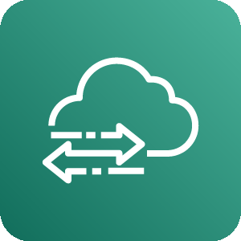 | `from resources.aws.migration import Datasync` |
|  | `from resources.aws.migration import DatabaseMigrationService` |
|  | `from resources.aws.migration import MigrationAndTransfer` |
|  | `from resources.aws.migration import CloudendureMigration` |
|  | `from resources.aws.migration import Snowmobile` |
|  | `from resources.aws.migration import ServerMigrationService` |
|  | `from resources.aws.migration import MigrationHub` |
|  | `from resources.aws.migration import Snowball` |
|  | `from resources.aws.migration import SnowballEdge` |
|  | `from resources.aws.migration import DatasyncAgent` |
|  | `from resources.aws.migration import ApplicationDiscoveryService` |
|  | `from resources.aws.migration import TransferForSftp` |
|  | `from resources.aws.mobile import Pinpoint` |
|  | `from resources.aws.mobile import DeviceFarm` |
|  | `from resources.aws.mobile import Appsync` |
|  | `from resources.aws.mobile import ApiGateway` |
|  | `from resources.aws.mobile import Amplify` |
|  | `from resources.aws.mobile import ApiGatewayEndpoint` |
|  | `from resources.aws.mobile import Mobile` |
|  | `from resources.aws.business import BusinessApplications` |
|  | `from resources.aws.business import Workmail` |
|  | `from resources.aws.business import AlexaForBusiness` |
|  | `from resources.aws.business import Chime` |
|  | `from resources.aws.network import PublicSubnet` |
|  | `from resources.aws.network import Privatelink` |
|  | `from resources.aws.network import Nacl` |
|  | `from resources.aws.network import VpcElasticNetworkInterface` |
|  | `from resources.aws.network import GlobalAccelerator` |
|  | `from resources.aws.network import ElbClassicLoadBalancer` |
|  | `from resources.aws.network import Endpoint` |
|  | `from resources.aws.network import CloudfrontEdgeLocation` |
|  | `from resources.aws.network import AppMesh` |
|  | `from resources.aws.network import Cloudfront` |
|  | `from resources.aws.network import VpcFlowLogs` |
|  | `from resources.aws.network import VpcRouter` |
|  | `from resources.aws.network import VpnGateway` |
|  | `from resources.aws.network import VpcPeering` |
|  | `from resources.aws.network import Vpc` |
|  | `from resources.aws.network import InternetGateway` |
|  | `from resources.aws.network import TransitGateway` |
|  | `from resources.aws.network import ApiGateway` |
|  | `from resources.aws.network import CloudfrontStreamingDistribution` |
|  | `from resources.aws.network import ElbNetworkLoadBalancer` |
|  | `from resources.aws.network import VpcTrafficMirroring` |
|  | `from resources.aws.network import DirectConnect` |
|  | `from resources.aws.network import Route53` |
|  | `from resources.aws.network import NetworkingAndContentDelivery` |
|  | `from resources.aws.network import VpcElasticNetworkAdapter` |
|  | `from resources.aws.network import VpnConnection` |
|  | `from resources.aws.network import ApiGatewayEndpoint` |
|  | `from resources.aws.network import CloudMap` |
|  | `from resources.aws.network import RouteTable` |
|  | `from resources.aws.network import VpcCustomerGateway` |
|  | `from resources.aws.network import ElbApplicationLoadBalancer` |
|  | `from resources.aws.network import SiteToSiteVpn` |
|  | `from resources.aws.network import Route53HostedZone` |
|  | `from resources.aws.network import ElasticLoadBalancing` |
|  | `from resources.aws.network import ClientVpn` |
|  | `from resources.aws.network import NatGateway` |
|  | `from resources.aws.network import PrivateSubnet` |
|  | `from resources.aws.network import CloudfrontDownloadDistribution` |
|  | `from resources.aws.security import IdentityAndAccessManagementIamAccessAnalyzer` |
|  | `from resources.aws.security import IdentityAndAccessManagementIamTemporarySecurityCredential` |
|  | `from resources.aws.security import Guardduty` |
|  | `from resources.aws.security import WafFilteringRule` |
|  | `from resources.aws.security import IdentityAndAccessManagementIamMfaToken` |
|  | `from resources.aws.security import IdentityAndAccessManagementIam` |
|  | `from resources.aws.security import Detective` |
|  | `from resources.aws.security import Cloudhsm` |
|  | `from resources.aws.security import CertificateManager` |
|  | `from resources.aws.security import SecurityHubFinding` |
|  | `from resources.aws.security import Waf` |
|  | `from resources.aws.security import Macie` |
|  | `from resources.aws.security import ShieldAdvanced` |
|  | `from resources.aws.security import CloudDirectory` |
|  | `from resources.aws.security import Artifact` |
|  | `from resources.aws.security import Shield` |
|  | `from resources.aws.security import SimpleAd` |
|  | `from resources.aws.security import SecurityHub` |
|  | `from resources.aws.security import FirewallManager` |
|  | `from resources.aws.security import IdentityAndAccessManagementIamEncryptedData` |
|  | `from resources.aws.security import Inspector` |
|  | `from resources.aws.security import InspectorAgent` |
|  | `from resources.aws.security import SecurityIdentityAndCompliance` |
|  | `from resources.aws.security import ManagedMicrosoftAd` |
|  | `from resources.aws.security import IdentityAndAccessManagementIamAwsStsAlternate` |
|  | `from resources.aws.security import SingleSignOn` |
|  | `from resources.aws.security import IdentityAndAccessManagementIamLongTermSecurityCredential` |
|  | `from resources.aws.security import CertificateAuthority` |
|  | `from resources.aws.security import AdConnector` |
|  | `from resources.aws.security import IdentityAndAccessManagementIamPermissions` |
|  | `from resources.aws.security import ResourceAccessManager` |
|  | `from resources.aws.security import IdentityAndAccessManagementIamRole` |
|  | `from resources.aws.security import Cognito` |
|  | `from resources.aws.security import IdentityAndAccessManagementIamDataEncryptionKey` |
|  | `from resources.aws.security import IdentityAndAccessManagementIamAddOn` |
|  | `from resources.aws.security import IdentityAndAccessManagementIamAwsSts` |
|  | `from resources.aws.security import DirectoryService` |
|  | `from resources.aws.security import KeyManagementService` |
|  | `from resources.aws.security import SecretsManager` |
|  | `from resources.aws.database import Elasticache` |
|  | `from resources.aws.database import ElasticacheForMemcached` |
|  | `from resources.aws.database import Database` |
|  | `from resources.aws.database import DocumentdbMongodbCompatibility` |
|  | `from resources.aws.database import RdsMysqlInstance` |
|  | `from resources.aws.database import DatabaseMigrationService` |
|  | `from resources.aws.database import AuroraInstance` |
|  | `from resources.aws.database import RdsMariadbInstance` |
|  | `from resources.aws.database import DynamodbItems` |
|  | `from resources.aws.database import ElasticacheCacheNode` |
|  | `from resources.aws.database import Rds` |
|  | `from resources.aws.database import QuantumLedgerDatabaseQldb` |
|  | `from resources.aws.database import DynamodbGlobalSecondaryIndex` |
|  | `from resources.aws.database import DynamodbAttribute` |
|  | `from resources.aws.database import KeyspacesManagedApacheCassandraService` |
|  | `from resources.aws.database import Timestream` |
|  | `from resources.aws.database import RdsOnVmware` |
|  | `from resources.aws.database import DynamodbItem` |
|  | `from resources.aws.database import Neptune` |
|  | `from resources.aws.database import DynamodbAttributes` |
|  | `from resources.aws.database import RdsSqlServerInstance` |
|  | `from resources.aws.database import Dynamodb` |
|  | `from resources.aws.database import RedshiftDenseComputeNode` |
|  | `from resources.aws.database import DatabaseMigrationServiceDatabaseMigrationWorkflow` |
|  | `from resources.aws.database import RdsOracleInstance` |
|  | `from resources.aws.database import RedshiftDenseStorageNode` |
|  | `from resources.aws.database import Aurora` |
|  | `from resources.aws.database import RdsInstance` |
|  | `from resources.aws.database import DynamodbTable` |
|  | `from resources.aws.database import ElasticacheForRedis` |
|  | `from resources.aws.database import DynamodbDax` |
|  | `from resources.aws.database import Redshift` |
|  | `from resources.aws.database import RdsPostgresqlInstance` |
|  | `from resources.aws.blockchain import QuantumLedgerDatabaseQldb` |
|  | `from resources.aws.blockchain import BlockchainResource` |
|  | `from resources.aws.blockchain import ManagedBlockchain` |
|  | `from resources.aws.blockchain import Blockchain` |
|  | `from resources.aws.management import CloudformationStack` |
|  | `from resources.aws.management import CloudformationChangeSet` |
|  | `from resources.aws.management import CloudwatchEventTimeBased` |
|  | `from resources.aws.management import OpsworksDeployments` |
|  | `from resources.aws.management import CommandLineInterface` |
|  | `from resources.aws.management import TrustedAdvisorChecklistCost` |
|  | `from resources.aws.management import SystemsManagerPatchManager` |
|  | `from resources.aws.management import Cloudtrail` |
|  | `from resources.aws.management import Config` |
|  | `from resources.aws.management import OpsworksApps` |
|  | `from resources.aws.management import OpsworksResources` |
|  | `from resources.aws.management import TrustedAdvisor` |
|  | `from resources.aws.management import SystemsManager` |
|  | `from resources.aws.management import SystemsManagerAutomation` |
|  | `from resources.aws.management import SystemsManagerStateManager` |
|  | `from resources.aws.management import SystemsManagerRunCommand` |
|  | `from resources.aws.management import CloudwatchEventEventBased` |
|  | `from resources.aws.management import SystemsManagerDocuments` |
|  | `from resources.aws.management import PersonalHealthDashboard` |
|  | `from resources.aws.management import OpsworksMonitoring` |
|  | `from resources.aws.management import ServiceCatalog` |
|  | `from resources.aws.management import CloudwatchAlarm` |
|  | `from resources.aws.management import OpsworksPermissions` |
|  | `from resources.aws.management import SystemsManagerParameterStore` |
|  | `from resources.aws.management import ManagementConsole` |
|  | `from resources.aws.management import Codeguru` |
|  | `from resources.aws.management import CloudformationTemplate` |
|  | `from resources.aws.management import OpsworksLayers` |
|  | `from resources.aws.management import OrganizationsOrganizationalUnit` |
|  | `from resources.aws.management import ControlTower` |
|  | `from resources.aws.management import OpsworksInstances` |
|  | `from resources.aws.management import ManagedServices` |
|  | `from resources.aws.management import LicenseManager` |
|  | `from resources.aws.management import Cloudwatch` |
|  | `from resources.aws.management import CloudwatchRule` |
|  | `from resources.aws.management import WellArchitectedTool` |
|  | `from resources.aws.management import TrustedAdvisorChecklistPerformance` |
|  | `from resources.aws.management import Opsworks` |
|  | `from resources.aws.management import ManagementAndGovernance` |
|  | `from resources.aws.management import OpsworksStack` |
|  | `from resources.aws.management import TrustedAdvisorChecklistSecurity` |
|  | `from resources.aws.management import SystemsManagerOpscenter` |
|  | `from resources.aws.management import Organizations` |
|  | `from resources.aws.management import Chatbot` |
|  | `from resources.aws.management import Cloudformation` |
|  | `from resources.aws.management import OrganizationsAccount` |
|  | `from resources.aws.management import SystemsManagerMaintenanceWindows` |
|  | `from resources.aws.management import TrustedAdvisorChecklist` |
|  | `from resources.aws.management import TrustedAdvisorChecklistFaultTolerant` |
|  | `from resources.aws.management import AutoScaling` |
|  | `from resources.aws.management import SystemsManagerInventory` |
|  | `from resources.aws.ar import ArVr` |
|  | `from resources.aws.ar import Sumerian` |
|  | `from resources.aws.compute import Ec2ElasticIpAddress` |
|  | `from resources.aws.compute import Ec2ImageBuilder` |
|  | `from resources.aws.compute import ServerlessApplicationRepository` |
|  | `from resources.aws.compute import ThinkboxKrakatoaRounded` |
|  | `from resources.aws.compute import ServerlessApplicationRepositoryRounded` |
|  | `from resources.aws.compute import ThinkboxSequoiaRounded` |
|  | `from resources.aws.compute import ThinkboxSequoia` |
|  | `from resources.aws.compute import ElasticBeanstalkApplication` |
|  | `from resources.aws.compute import ThinkboxFrost` |
|  | `from resources.aws.compute import ThinkboxDeadline` |
|  | `from resources.aws.compute import ElasticContainerServiceRounded` |
|  | `from resources.aws.compute import ComputeRounded` |
|  | `from resources.aws.compute import ThinkboxXmeshRounded` |
|  | `from resources.aws.compute import LambdaRounded` |
|  | `from resources.aws.compute import Wavelength` |
|  | `from resources.aws.compute import Ec2` |
|  | `from resources.aws.compute import ElasticContainerServiceService` |
|  | `from resources.aws.compute import Ec2Ami` |
|  | `from resources.aws.compute import ThinkboxKrakatoa` |
|  | `from resources.aws.compute import ElasticContainerServiceContainer` |
|  | `from resources.aws.compute import VmwareCloudOnAws` |
|  | `from resources.aws.compute import ElasticKubernetesService` |
|  | `from resources.aws.compute import Ec2ContainerRegistryRegistry` |
|  | `from resources.aws.compute import BatchRounded` |
|  | `from resources.aws.compute import ThinkboxXmesh` |
|  | `from resources.aws.compute import Ec2ContainerRegistryRounded` |
|  | `from resources.aws.compute import ThinkboxDraft` |
|  | `from resources.aws.compute import ElasticContainerService` |
|  | `from resources.aws.compute import ApplicationAutoScaling` |
|  | `from resources.aws.compute import ElasticBeanstalkDeployment` |
|  | `from resources.aws.compute import LightsailRounded` |
|  | `from resources.aws.compute import ThinkboxDraftRounded` |
|  | `from resources.aws.compute import ElasticBeanstalk` |
|  | `from resources.aws.compute import ThinkboxStoke` |
|  | `from resources.aws.compute import ComputeOptimizer` |
|  | `from resources.aws.compute import ApplicationAutoScalingRounded` |
|  | `from resources.aws.compute import VmwareCloudOnAwsRounded` |
|  | `from resources.aws.compute import ThinkboxFrostRounded` |
|  | `from resources.aws.compute import OutpostsRounded` |
|  | `from resources.aws.compute import Ec2SpotInstance` |
|  | `from resources.aws.compute import LocalZones` |
|  | `from resources.aws.compute import LambdaFunction` |
|  | `from resources.aws.compute import Ec2ContainerRegistry` |
|  | `from resources.aws.compute import Lambda` |
|  | `from resources.aws.compute import Ec2Instances` |
|  | `from resources.aws.compute import Compute` |
|  | `from resources.aws.compute import Ec2Rounded` |
|  | `from resources.aws.compute import FargateRounded` |
|  | `from resources.aws.compute import ThinkboxStokeRounded` |
|  | `from resources.aws.compute import Outposts` |
|  | `from resources.aws.compute import ElasticBeanstalkRounded` |
|  | `from resources.aws.compute import ThinkboxDeadlineRounded` |
|  | `from resources.aws.compute import Ec2ContainerRegistryImage` |
|  | `from resources.aws.compute import Ec2Rescue` |
|  | `from resources.aws.compute import Ec2AutoScaling` |
|  | `from resources.aws.compute import Ec2Instance` |
|  | `from resources.aws.compute import ElasticKubernetesServiceRounded` |
|  | `from resources.aws.compute import Fargate` |
|  | `from resources.aws.compute import Lightsail` |
|  | `from resources.aws.compute import Batch` |
|  | `from resources.aws.devtools import Codestar` |
|  | `from resources.aws.devtools import XRay` |
|  | `from resources.aws.devtools import CommandLineInterface` |
|  | `from resources.aws.devtools import ToolsAndSdks` |
|  | `from resources.aws.devtools import Codedeploy` |
|  | `from resources.aws.devtools import Cloud9` |
|  | `from resources.aws.devtools import CloudDevelopmentKit` |
|  | `from resources.aws.devtools import Codepipeline` |
|  | `from resources.aws.devtools import Codebuild` |
|  | `from resources.aws.devtools import DeveloperTools` |
|  | `from resources.aws.devtools import Codecommit` |
|  | `from resources.aws.devtools import Cloud9Resource` |
|  | `from resources.aws.integration import SimpleQueueServiceSqsQueue` |
|  | `from resources.aws.integration import SimpleNotificationServiceSns` |
|  | `from resources.aws.integration import SimpleNotificationServiceSnsHttpNotification` |
|  | `from resources.aws.integration import ApplicationIntegration` |
|  | `from resources.aws.integration import SimpleNotificationServiceSnsTopic` |
|  | `from resources.aws.integration import Mq` |
|  | `from resources.aws.integration import ExpressWorkflows` |
|  | `from resources.aws.integration import StepFunctions` |
|  | `from resources.aws.integration import Eventbridge` |
|  | `from resources.aws.integration import SimpleQueueServiceSqsMessage` |
|  | `from resources.aws.integration import Appsync` |
|  | `from resources.aws.integration import EventbridgeSaasPartnerEventBusResource` |
|  | `from resources.aws.integration import SimpleNotificationServiceSnsEmailNotification` |
|  | `from resources.aws.integration import SimpleQueueServiceSqs` |
|  | `from resources.aws.integration import EventbridgeDefaultEventBusResource` |
|  | `from resources.aws.integration import EventResource` |
|  | `from resources.aws.integration import ConsoleMobileApplication` |
|  | `from resources.aws.integration import EventbridgeCustomEventBusResource` |
|  | `from resources.aws.enablement import Support` |
|  | `from resources.aws.enablement import CustomerEnablement` |
|  | `from resources.aws.enablement import ProfessionalServices` |
|  | `from resources.aws.enablement import ManagedServices` |
|  | `from resources.aws.enablement import Iq` |
|  | `from resources.aws.analytics import DataPipeline` |
|  | `from resources.aws.analytics import ElasticsearchService` |
|  | `from resources.aws.analytics import Analytics` |
|  | `from resources.aws.analytics import Kinesis` |
|  | `from resources.aws.analytics import LakeFormation` |
|  | `from resources.aws.analytics import Glue` |
|  | `from resources.aws.analytics import DataLakeResource` |
|  | `from resources.aws.analytics import EmrEngine` |
|  | `from resources.aws.analytics import Cloudsearch` |
|  | `from resources.aws.analytics import KinesisDataFirehose` |
|  | `from resources.aws.analytics import ManagedStreamingForKafka` |
|  | `from resources.aws.analytics import EmrEngineMaprM3` |
|  | `from resources.aws.analytics import Quicksight` |
|  | `from resources.aws.analytics import KinesisDataAnalytics` |
|  | `from resources.aws.analytics import CloudsearchSearchDocuments` |
|  | `from resources.aws.analytics import EmrHdfsCluster` |
|  | `from resources.aws.analytics import KinesisVideoStreams` |
|  | `from resources.aws.analytics import Athena` |
|  | `from resources.aws.analytics import RedshiftDenseComputeNode` |
|  | `from resources.aws.analytics import EmrEngineMaprM5` |
|  | `from resources.aws.analytics import Emr` |
|  | `from resources.aws.analytics import RedshiftDenseStorageNode` |
|  | `from resources.aws.analytics import KinesisDataStreams` |
|  | `from resources.aws.analytics import GlueCrawlers` |
|  | `from resources.aws.analytics import EmrCluster` |
|  | `from resources.aws.analytics import EmrEngineMaprM7` |
|  | `from resources.aws.analytics import GlueDataCatalog` |
|  | `from resources.aws.analytics import Redshift` |
|  | `from resources.aws.quantum import Braket` |
|  | `from resources.aws.quantum import QuantumTechnologies` |
|  | `from resources.aws.storage import StorageGatewayVirtualTapeLibrary` |
|  | `from resources.aws.storage import FsxForLustre` |
|  | `from resources.aws.storage import ElasticBlockStoreEbsVolume` |
|  | `from resources.aws.storage import ElasticBlockStoreEbsSnapshot` |
|  | `from resources.aws.storage import Snowmobile` |
|  | `from resources.aws.storage import SimpleStorageServiceS3Bucket` |
|  | `from resources.aws.storage import StorageGateway` |
|  | `from resources.aws.storage import S3GlacierVault` |
|  | `from resources.aws.storage import Snowball` |
|  | `from resources.aws.storage import SimpleStorageServiceS3Object` |
|  | `from resources.aws.storage import Backup` |
|  | `from resources.aws.storage import ElasticBlockStoreEbs` |
|  | `from resources.aws.storage import SnowballEdge` |
|  | `from resources.aws.storage import S3Glacier` |
|  | `from resources.aws.storage import StorageGatewayNonCachedVolume` |
|  | `from resources.aws.storage import CloudendureDisasterRecovery` |
|  | `from resources.aws.storage import StorageGatewayCachedVolume` |
|  | `from resources.aws.storage import ElasticFileSystemEfs` |
|  | `from resources.aws.storage import EfsInfrequentaccessPrimaryBg` |
|  | `from resources.aws.storage import S3GlacierArchive` |
|  | `from resources.aws.storage import Fsx` |
|  | `from resources.aws.storage import EfsStandardPrimaryBg` |
|  | `from resources.aws.storage import ElasticFileSystemEfsFileSystem` |
|  | `from resources.aws.storage import MultipleVolumesResource` |
|  | `from resources.aws.storage import SimpleStorageServiceS3` |
|  | `from resources.aws.storage import Storage` |
|  | `from resources.aws.storage import SimpleStorageServiceS3BucketWithObjects` |
|  | `from resources.aws.storage import SnowFamilySnowballImportExport` |
|  | `from resources.aws.storage import FsxForWindowsFileServer` |
|  | `from resources.aws.general import User` |
|  | `from resources.aws.general import MobileClient` |
|  | `from resources.aws.general import InternetAlt1` |
|  | `from resources.aws.general import SamlToken` |
|  | `from resources.aws.general import Multimedia` |
|  | `from resources.aws.general import Disk` |
|  | `from resources.aws.general import General` |
|  | `from resources.aws.general import SslPadlock` |
|  | `from resources.aws.general import Client` |
|  | `from resources.aws.general import GenericSdk` |
|  | `from resources.aws.general import GenericSamlToken` |
|  | `from resources.aws.general import Toolkit` |
|  | `from resources.aws.general import InternetGateway` |
|  | `from resources.aws.general import GenericOfficeBuilding` |
|  | `from resources.aws.general import TapeStorage` |
|  | `from resources.aws.general import Sdk` |
|  | `from resources.aws.general import TraditionalServer` |
| 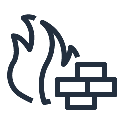 | `from resources.aws.general import GenericFirewall` |
|  | `from resources.aws.general import OfficeBuilding` |
|  | `from resources.aws.general import Marketplace` |
|  | `from resources.aws.general import Users` |
|  | `from resources.aws.general import GenericDatabase` |
|  | `from resources.aws.general import Forums` |
|  | `from resources.aws.general import InternetAlt2` |
|  | `from resources.aws.ml import Personalize` |
|  | `from resources.aws.ml import Rekognition` |
|  | `from resources.aws.ml import ElasticInference` |
|  | `from resources.aws.ml import SagemakerModel` |
|  | `from resources.aws.ml import RekognitionVideo` |
|  | `from resources.aws.ml import Polly` |
|  | `from resources.aws.ml import Kendra` |
|  | `from resources.aws.ml import RekognitionImage` |
|  | `from resources.aws.ml import SagemakerTrainingJob` |
|  | `from resources.aws.ml import Translate` |
|  | `from resources.aws.ml import Comprehend` |
|  | `from resources.aws.ml import Sagemaker` |
|  | `from resources.aws.ml import Deepracer` |
|  | `from resources.aws.ml import AugmentedAi` |
|  | `from resources.aws.ml import MachineLearning` |
|  | `from resources.aws.ml import SagemakerNotebook` |
|  | `from resources.aws.ml import Lex` |
|  | `from resources.aws.ml import ApacheMxnetOnAws` |
|  | `from resources.aws.ml import Forecast` |
|  | `from resources.aws.ml import TensorflowOnAws` |
|  | `from resources.aws.ml import DeepLearningContainers` |
|  | `from resources.aws.ml import FraudDetector` |
|  | `from resources.aws.ml import Textract` |
|  | `from resources.aws.ml import Deeplens` |
|  | `from resources.aws.ml import DeepLearningAmis` |
|  | `from resources.aws.ml import SagemakerGroundTruth` |
|  | `from resources.aws.ml import Transcribe` |
|  | `from resources.aws.ml import Deepcomposer` |
|  | `from resources.aws.enduser import Appstream20` |
| 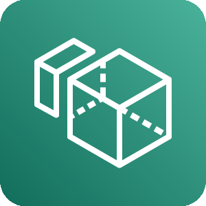 | `from resources.aws.enduser import Workspaces` |
|  | `from resources.aws.enduser import Workdocs` |
|  | `from resources.aws.enduser import Worklink` |
|  | `from resources.aws.enduser import DesktopAndAppStreaming` |
|  | `from resources.aws.game import GameTech` |
|  | `from resources.aws.game import Gamelift` |
|  | `from resources.aws.engagement import SimpleEmailServiceSes` |
|  | `from resources.aws.engagement import Pinpoint` |
|  | `from resources.aws.engagement import Connect` |
|  | `from resources.aws.engagement import CustomerEngagement` |
|  | `from resources.aws.engagement import SimpleEmailServiceSesEmail` |
|  | `from resources.azure.iot import TimeSeriesInsightsEnvironments` |
|  | `from resources.azure.iot import TimeSeriesInsightsEventsSources` |
|  | `from resources.azure.iot import IotCentralApplications` |
|  | `from resources.azure.iot import IotHubSecurity` |
|  | `from resources.azure.iot import Sphere` |
|  | `from resources.azure.iot import Maps` |
| 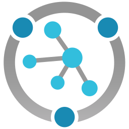 | `from resources.azure.iot import DeviceProvisioningServices` |
|  | `from resources.azure.iot import DigitalTwins` |
|  | `from resources.azure.iot import IotHub` |
|  | `from resources.azure.iot import Windows10IotCoreServices` |
|  | `from resources.azure.migration import DataBoxEdge` |
|  | `from resources.azure.migration import DataBox` |
|  | `from resources.azure.migration import DatabaseMigrationServices` |
|  | `from resources.azure.migration import RecoveryServicesVaults` |
|  | `from resources.azure.migration import MigrationProjects` |
|  | `from resources.azure.mobile import NotificationHubs` |
|  | `from resources.azure.mobile import AppServiceMobile` |
|  | `from resources.azure.mobile import MobileEngagement` |
|  | `from resources.azure.devops import LabServices` |
|  | `from resources.azure.devops import Repos` |
|  | `from resources.azure.devops import Boards` |
|  | `from resources.azure.devops import Pipelines` |
|  | `from resources.azure.devops import DevtestLabs` |
|  | `from resources.azure.devops import TestPlans` |
|  | `from resources.azure.devops import ApplicationInsights` |
|  | `from resources.azure.devops import Artifacts` |
|  | `from resources.azure.devops import Devops` |
|  | `from resources.azure.network import VirtualNetworkGateways` |
|  | `from resources.azure.network import VirtualWans` |
|  | `from resources.azure.network import FrontDoors` |
|  | `from resources.azure.network import ExpressrouteCircuits` |
|  | `from resources.azure.network import DdosProtectionPlans` |
|  | `from resources.azure.network import NetworkSecurityGroupsClassic` |
|  | `from resources.azure.network import Connections` |
|  | `from resources.azure.network import ApplicationGateway` |
|  | `from resources.azure.network import VirtualNetworks` |
|  | `from resources.azure.network import PublicIpAddresses` |
|  | `from resources.azure.network import Firewall` |
|  | `from resources.azure.network import CdnProfiles` |
|  | `from resources.azure.network import TrafficManagerProfiles` |
|  | `from resources.azure.network import RouteFilters` |
|  | `from resources.azure.network import NetworkWatcher` |
|  | `from resources.azure.network import ServiceEndpointPolicies` |
|  | `from resources.azure.network import LocalNetworkGateways` |
|  | `from resources.azure.network import RouteTables` |
|  | `from resources.azure.network import DnsZones` |
|  | `from resources.azure.network import VirtualNetworkClassic` |
|  | `from resources.azure.network import NetworkInterfaces` |
|  | `from resources.azure.network import OnPremisesDataGateways` |
|  | `from resources.azure.network import DnsPrivateZones` |
|  | `from resources.azure.network import ReservedIpAddressesClassic` |
|  | `from resources.azure.network import Subnets` |
|  | `from resources.azure.network import LoadBalancers` |
|  | `from resources.azure.network import ApplicationSecurityGroups` |
|  | `from resources.azure.security import Sentinel` |
|  | `from resources.azure.security import ConditionalAccess` |
|  | `from resources.azure.security import KeyVaults` |
|  | `from resources.azure.security import Defender` |
|  | `from resources.azure.security import SecurityCenter` |
|  | `from resources.azure.security import ApplicationSecurityGroups` |
|  | `from resources.azure.security import ExtendedSecurityUpdates` |
|  | `from resources.azure.database import SqlVm` |
|  | `from resources.azure.database import SynapseAnalytics` |
|  | `from resources.azure.database import DataExplorerClusters` |
|  | `from resources.azure.database import ElasticJobAgents` |
|  | `from resources.azure.database import SqlServers` |
|  | `from resources.azure.database import DataFactory` |
|  | `from resources.azure.database import DataLake` |
|  | `from resources.azure.database import SqlDatabases` |
|  | `from resources.azure.database import DatabaseForMysqlServers` |
|  | `from resources.azure.database import VirtualClusters` |
|  | `from resources.azure.database import SqlManagedInstances` |
|  | `from resources.azure.database import DatabaseForMariadbServers` |
|  | `from resources.azure.database import ManagedDatabases` |
|  | `from resources.azure.database import VirtualDatacenter` |
|  | `from resources.azure.database import CacheForRedis` |
|  | `from resources.azure.database import SsisLiftAndShiftIr` |
|  | `from resources.azure.database import SqlServerStretchDatabases` |
|  | `from resources.azure.database import BlobStorage` |
|  | `from resources.azure.database import Sql` |
|  | `from resources.azure.database import DatabaseForPostgresqlServers` |
|  | `from resources.azure.database import SqlDatawarehouse` |
|  | `from resources.azure.database import InstancePools` |
|  | `from resources.azure.database import CosmosDb` |
|  | `from resources.azure.database import ElasticDatabasePools` |
|  | `from resources.azure.web import AppServiceEnvironments` |
|  | `from resources.azure.web import Signalr` |
|  | `from resources.azure.web import Search` |
|  | `from resources.azure.web import MediaServices` |
|  | `from resources.azure.web import AppServicePlans` |
|  | `from resources.azure.web import NotificationHubNamespaces` |
|  | `from resources.azure.web import AppServiceDomains` |
|  | `from resources.azure.web import AppServiceCertificates` |
|  | `from resources.azure.web import ApiConnections` |
|  | `from resources.azure.web import AppServices` |
|  | `from resources.azure.compute import ImageVersions` |
|  | `from resources.azure.compute import SapHanaOnAzure` |
|  | `from resources.azure.compute import Disks` |
|  | `from resources.azure.compute import CitrixVirtualDesktopsEssentials` |
|  | `from resources.azure.compute import VmLinux` |
|  | `from resources.azure.compute import SharedImageGalleries` |
|  | `from resources.azure.compute import MeshApplications` |
|  | `from resources.azure.compute import Workspaces` |
|  | `from resources.azure.compute import CloudServicesClassic` |
|  | `from resources.azure.compute import FunctionApps` |
|  | `from resources.azure.compute import OsImages` |
|  | `from resources.azure.compute import SpringCloud` |
|  | `from resources.azure.compute import BatchAccounts` |
|  | `from resources.azure.compute import ServiceFabricClusters` |
|  | `from resources.azure.compute import CloudsimpleVirtualMachines` |
|  | `from resources.azure.compute import DiskSnapshots` |
|  | `from resources.azure.compute import VmScaleSet` |
|  | `from resources.azure.compute import Vm` |
|  | `from resources.azure.compute import VmWindows` |
|  | `from resources.azure.compute import AvailabilitySets` |
|  | `from resources.azure.compute import DiskEncryptionSets` |
|  | `from resources.azure.compute import CloudServices` |
|  | `from resources.azure.compute import AutomanagedVm` |
|  | `from resources.azure.compute import ImageDefinitions` |
|  | `from resources.azure.compute import KubernetesServices` |
|  | `from resources.azure.compute import ContainerInstances` |
|  | `from resources.azure.compute import AppServices` |
|  | `from resources.azure.compute import VmClassic` |
|  | `from resources.azure.compute import ContainerRegistries` |
|  | `from resources.azure.compute import VmImages` |
|  | `from resources.azure.integration import ApiForFhir` |
|  | `from resources.azure.integration import SoftwareAsAService` |
|  | `from resources.azure.integration import IntegrationAccounts` |
|  | `from resources.azure.integration import ServiceBusRelays` |
|  | `from resources.azure.integration import SendgridAccounts` |
|  | `from resources.azure.integration import ServiceCatalogManagedApplicationDefinitions` |
|  | `from resources.azure.integration import ApiManagement` |
|  | `from resources.azure.integration import AppConfiguration` |
| 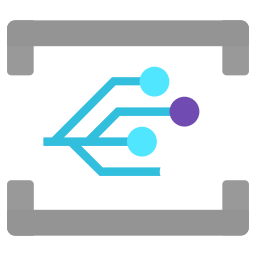 | `from resources.azure.integration import EventGridDomains` |
|  | `from resources.azure.integration import IntegrationServiceEnvironments` |
|  | `from resources.azure.integration import SystemTopic` |
|  | `from resources.azure.integration import PartnerTopic` |
|  | `from resources.azure.integration import DataCatalog` |
|  | `from resources.azure.integration import StorsimpleDeviceManagers` |
|  | `from resources.azure.integration import LogicApps` |
|  | `from resources.azure.integration import ServiceBus` |
|  | `from resources.azure.integration import EventGridTopics` |
|  | `from resources.azure.integration import LogicAppsCustomConnector` |
|  | `from resources.azure.integration import EventGridSubscriptions` |
|  | `from resources.azure.analytics import EventHubs` |
|  | `from resources.azure.analytics import SynapseAnalytics` |
|  | `from resources.azure.analytics import DataExplorerClusters` |
|  | `from resources.azure.analytics import DataLakeAnalytics` |
| 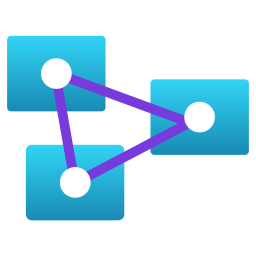 | `from resources.azure.analytics import AnalysisServices` |
|  | `from resources.azure.analytics import LogAnalyticsWorkspaces` |
|  | `from resources.azure.analytics import Hdinsightclusters` |
|  | `from resources.azure.analytics import DataLakeStoreGen1` |
| 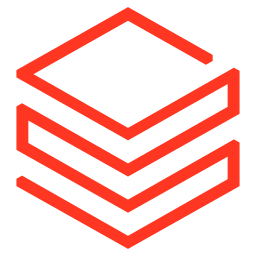 | `from resources.azure.analytics import Databricks` |
|  | `from resources.azure.analytics import EventHubClusters` |
|  | `from resources.azure.analytics import DataFactories` |
|  | `from resources.azure.analytics import StreamAnalyticsJobs` |
|  | `from resources.azure.storage import StorageAccounts` |
|  | `from resources.azure.storage import StorsimpleDataManagers` |
|  | `from resources.azure.storage import StorageAccountsClassic` |
| 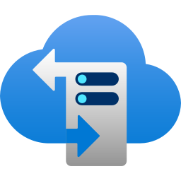 | `from resources.azure.storage import StorageSyncServices` |
|  | `from resources.azure.storage import DataBox` |
|  | `from resources.azure.storage import QueuesStorage` |
|  | `from resources.azure.storage import DataLakeStorage` |
|  | `from resources.azure.storage import Azurefxtedgefiler` |
|  | `from resources.azure.storage import StorsimpleDeviceManagers` |
|  | `from resources.azure.storage import BlobStorage` |
|  | `from resources.azure.storage import ArchiveStorage` |
|  | `from resources.azure.storage import GeneralStorage` |
|  | `from resources.azure.storage import StorageExplorer` |
|  | `from resources.azure.storage import TableStorage` |
|  | `from resources.azure.storage import DataBoxEdgeDataBoxGateway` |
|  | `from resources.azure.storage import NetappFiles` |
|  | `from resources.azure.general import Supportrequests` |
|  | `from resources.azure.general import Recent` |
|  | `from resources.azure.general import Usericon` |
|  | `from resources.azure.general import Support` |
|  | `from resources.azure.general import Developertools` |
|  | `from resources.azure.general import Tags` |
|  | `from resources.azure.general import Azurehome` |
|  | `from resources.azure.general import Userprivacy` |
|  | `from resources.azure.general import Shareddashboard` |
|  | `from resources.azure.general import Resourcegroups` |
|  | `from resources.azure.general import Templates` |
|  | `from resources.azure.general import Userresource` |
|  | `from resources.azure.general import Reservations` |
|  | `from resources.azure.general import Twousericon` |
|  | `from resources.azure.general import Information` |
|  | `from resources.azure.general import Resource` |
|  | `from resources.azure.general import Helpsupport` |
|  | `from resources.azure.general import Quickstartcenter` |
|  | `from resources.azure.general import Subscriptions` |
|  | `from resources.azure.general import Marketplace` |
|  | `from resources.azure.general import Allresources` |
|  | `from resources.azure.general import Whatsnew` |
| 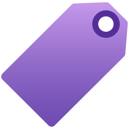 | `from resources.azure.general import Tag` |
|  | `from resources.azure.general import Userhealthicon` |
|  | `from resources.azure.general import Servicehealth` |
|  | `from resources.azure.general import Managementgroups` |
| 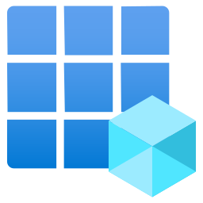 | `from resources.azure.identity import AppRegistrations` |
|  | `from resources.azure.identity import AdPrivilegedIdentityManagement` |
| 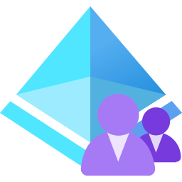 | `from resources.azure.identity import AdB2C` |
|  | `from resources.azure.identity import ConditionalAccess` |
|  | `from resources.azure.identity import Groups` |
|  | `from resources.azure.identity import AdDomainServices` |
|  | `from resources.azure.identity import IdentityGovernance` |
|  | `from resources.azure.identity import ManagedIdentities` |
|  | `from resources.azure.identity import InformationProtection` |
|  | `from resources.azure.identity import AccessReview` |
|  | `from resources.azure.identity import AdIdentityProtection` |
|  | `from resources.azure.identity import ActiveDirectoryConnectHealth` |
|  | `from resources.azure.identity import EnterpriseApplications` |
|  | `from resources.azure.identity import ActiveDirectory` |
|  | `from resources.azure.identity import Users` |
|  | `from resources.azure.ml import BotServices` |
|  | `from resources.azure.ml import MachineLearningStudioWebServices` |
|  | `from resources.azure.ml import MachineLearningStudioWorkspaces` |
|  | `from resources.azure.ml import MachineLearningStudioWebServicePlans` |
|  | `from resources.azure.ml import CognitiveServices` |
|  | `from resources.azure.ml import BatchAi` |
|  | `from resources.azure.ml import GenomicsAccounts` |
|  | `from resources.azure.ml import MachineLearningServiceWorkspaces` |
|  | `from resources.saas.alerting import Opsgenie` |
|  | `from resources.saas.alerting import Newrelic` |
|  | `from resources.saas.alerting import Pushover` |
|  | `from resources.saas.filesharing import Nextcloud` |
|  | `from resources.saas.media import Cloudinary` |
|  | `from resources.saas.logging import Papertrail` |
| 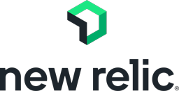 | `from resources.saas.logging import Newrelic` |
|  | `from resources.saas.logging import Datadog` |
|  | `from resources.saas.cdn import Cloudflare` |
|  | `from resources.saas.cdn import Akamai` |
|  | `from resources.saas.analytics import Stitch` |
|  | `from resources.saas.analytics import Snowflake` |
|  | `from resources.saas.social import Twitter` |
|  | `from resources.saas.social import Facebook` |
|  | `from resources.saas.identity import Okta` |
|  | `from resources.saas.identity import Auth0` |
|  | `from resources.saas.recommendation import Recombee` |
|  | `from resources.saas.chat import Slack` |
|  | `from resources.saas.chat import Discord` |
|  | `from resources.saas.chat import Mattermost` |
|  | `from resources.saas.chat import RocketChat` |
|  | `from resources.saas.chat import Telegram` |
|  | `from resources.saas.chat import Teams` |
|  | `from resources.generic.device import Tablet` |
|  | `from resources.generic.device import Mobile` |
|  | `from resources.generic.place import Datacenter` |
|  | `from resources.generic.network import Subnet` |
|  | `from resources.generic.network import Router` |
|  | `from resources.generic.network import Firewall` |
|  | `from resources.generic.network import Vpn` |
|  | `from resources.generic.network import Switch` |
|  | `from resources.generic.database import Sql` |
|  | `from resources.generic.os import Ubuntu` |
|  | `from resources.generic.os import Suse` |
|  | `from resources.generic.os import Centos` |
|  | `from resources.generic.os import Android` |
|  | `from resources.generic.os import Ios` |
|  | `from resources.generic.os import Windows` |
|  | `from resources.generic.os import LinuxGeneral` |
|  | `from resources.generic.virtualization import Xen` |
|  | `from resources.generic.virtualization import Virtualbox` |
|  | `from resources.generic.virtualization import Vmware` |
|  | `from resources.generic.compute import Rack` |
|  | `from resources.generic.blank import Blank` |
|  | `from resources.generic.storage import Storage` |
|  | `from resources.alibabacloud.iot import IotInternetDeviceId` |
|  | `from resources.alibabacloud.iot import IotLinkWan` |
|  | `from resources.alibabacloud.iot import IotMobileConnectionPackage` |
|  | `from resources.alibabacloud.iot import IotPlatform` |
|  | `from resources.alibabacloud.network import VirtualPrivateCloud` |
|  | `from resources.alibabacloud.network import ServerLoadBalancer` |
|  | `from resources.alibabacloud.network import SmartAccessGateway` |
|  | `from resources.alibabacloud.network import ExpressConnect` |
|  | `from resources.alibabacloud.network import Cdn` |
|  | `from resources.alibabacloud.network import CloudEnterpriseNetwork` |
|  | `from resources.alibabacloud.network import VpnGateway` |
|  | `from resources.alibabacloud.network import ElasticIpAddress` |
|  | `from resources.alibabacloud.network import NatGateway` |
|  | `from resources.alibabacloud.security import CrowdsourcedSecurityTesting` |
|  | `from resources.alibabacloud.security import SslCertificates` |
|  | `from resources.alibabacloud.security import IdVerification` |
|  | `from resources.alibabacloud.security import DataEncryptionService` |
|  | `from resources.alibabacloud.security import WebApplicationFirewall` |
|  | `from resources.alibabacloud.security import ManagedSecurityService` |
|  | `from resources.alibabacloud.security import AntiDdosPro` |
|  | `from resources.alibabacloud.security import AntiDdosBasic` |
|  | `from resources.alibabacloud.security import AntifraudService` |
|  | `from resources.alibabacloud.security import AntiBotService` |
|  | `from resources.alibabacloud.security import BastionHost` |
|  | `from resources.alibabacloud.security import DbAudit` |
|  | `from resources.alibabacloud.security import CloudFirewall` |
|  | `from resources.alibabacloud.security import CloudSecurityScanner` |
|  | `from resources.alibabacloud.security import SecurityCenter` |
|  | `from resources.alibabacloud.security import GameShield` |
|  | `from resources.alibabacloud.security import ContentModeration` |
|  | `from resources.alibabacloud.security import ServerGuard` |
|  | `from resources.alibabacloud.database import ApsaradbPpas` |
|  | `from resources.alibabacloud.database import DataTransmissionService` |
|  | `from resources.alibabacloud.database import DataManagementService` |
|  | `from resources.alibabacloud.database import DisributeRelationalDatabaseService` |
|  | `from resources.alibabacloud.database import ApsaradbPostgresql` |
|  | `from resources.alibabacloud.database import HybriddbForMysql` |
|  | `from resources.alibabacloud.database import ApsaradbCassandra` |
|  | `from resources.alibabacloud.database import RelationalDatabaseService` |
|  | `from resources.alibabacloud.database import DatabaseBackupService` |
|  | `from resources.alibabacloud.database import GraphDatabaseService` |
|  | `from resources.alibabacloud.database import ApsaradbHbase` |
|  | `from resources.alibabacloud.database import ApsaradbOceanbase` |
|  | `from resources.alibabacloud.database import ApsaradbPolardb` |
|  | `from resources.alibabacloud.database import ApsaradbMongodb` |
|  | `from resources.alibabacloud.database import ApsaradbRedis` |
|  | `from resources.alibabacloud.database import ApsaradbMemcache` |
|  | `from resources.alibabacloud.database import ApsaradbSqlserver` |
|  | `from resources.alibabacloud.web import Dns` |
|  | `from resources.alibabacloud.web import Domain` |
|  | `from resources.alibabacloud.compute import ResourceOrchestrationService` |
|  | `from resources.alibabacloud.compute import ServerLoadBalancer` |
|  | `from resources.alibabacloud.compute import ContainerService` |
|  | `from resources.alibabacloud.compute import WebAppService` |
|  | `from resources.alibabacloud.compute import ElasticSearch` |
|  | `from resources.alibabacloud.compute import ServerlessAppEngine` |
|  | `from resources.alibabacloud.compute import BatchCompute` |
|  | `from resources.alibabacloud.compute import ContainerRegistry` |
|  | `from resources.alibabacloud.compute import SimpleApplicationServer` |
|  | `from resources.alibabacloud.compute import OperationOrchestrationService` |
|  | `from resources.alibabacloud.compute import ElasticContainerInstance` |
|  | `from resources.alibabacloud.compute import ElasticComputeService` |
|  | `from resources.alibabacloud.compute import FunctionCompute` |
|  | `from resources.alibabacloud.compute import ElasticHighPerformanceComputing` |
|  | `from resources.alibabacloud.compute import AutoScaling` |
|  | `from resources.alibabacloud.application import BlockchainAsAService` |
|  | `from resources.alibabacloud.application import DirectMail` |
|  | `from resources.alibabacloud.application import BeeBot` |
|  | `from resources.alibabacloud.application import CloudCallCenter` |
|  | `from resources.alibabacloud.application import OpenSearch` |
|  | `from resources.alibabacloud.application import ApiGateway` |
|  | `from resources.alibabacloud.application import Yida` |
|  | `from resources.alibabacloud.application import PerformanceTestingService` |
|  | `from resources.alibabacloud.application import LogService` |
|  | `from resources.alibabacloud.application import MessageNotificationService` |
|  | `from resources.alibabacloud.application import RdCloud` |
|  | `from resources.alibabacloud.application import CodePipeline` |
|  | `from resources.alibabacloud.application import SmartConversationAnalysis` |
|  | `from resources.alibabacloud.application import NodeJsPerformancePlatform` |
|  | `from resources.alibabacloud.analytics import DataLakeAnalytics` |
|  | `from resources.alibabacloud.analytics import ClickHouse` |
|  | `from resources.alibabacloud.analytics import OpenSearch` |
|  | `from resources.alibabacloud.analytics import AnalyticDb` |
|  | `from resources.alibabacloud.analytics import ElaticMapReduce` |
|  | `from resources.alibabacloud.storage import ObjectTableStore` |
|  | `from resources.alibabacloud.storage import HybridCloudDisasterRecovery` |
|  | `from resources.alibabacloud.storage import FileStorageNas` |
|  | `from resources.alibabacloud.storage import FileStorageHdfs` |
|  | `from resources.alibabacloud.storage import CloudStorageGateway` |
|  | `from resources.alibabacloud.storage import HybridBackupRecovery` |
|  | `from resources.alibabacloud.storage import Imm` |
|  | `from resources.alibabacloud.storage import ObjectStorageService` |
|  | `from resources.alibabacloud.communication import MobilePush` |
|  | `from resources.alibabacloud.communication import DirectMail` |
|  | `from resources.programming.flowchart import Collate` |
|  | `from resources.programming.flowchart import Database` |
|  | `from resources.programming.flowchart import OffPageConnectorLeft` |
|  | `from resources.programming.flowchart import PredefinedProcess` |
|  | `from resources.programming.flowchart import ManualInput` |
|  | `from resources.programming.flowchart import OffPageConnectorRight` |
|  | `from resources.programming.flowchart import StartEnd` |
|  | `from resources.programming.flowchart import Delay` |
|  | `from resources.programming.flowchart import InputOutput` |
|  | `from resources.programming.flowchart import LoopLimit` |
|  | `from resources.programming.flowchart import Decision` |
|  | `from resources.programming.flowchart import MultipleDocuments` |
|  | `from resources.programming.flowchart import StoredData` |
|  | `from resources.programming.flowchart import Inspection` |
|  | `from resources.programming.flowchart import InternalStorage` |
|  | `from resources.programming.flowchart import Merge` |
|  | `from resources.programming.flowchart import Sort` |
|  | `from resources.programming.flowchart import Action` |
|  | `from resources.programming.flowchart import Or` |
|  | `from resources.programming.flowchart import Document` |
|  | `from resources.programming.flowchart import Display` |
|  | `from resources.programming.flowchart import Preparation` |
|  | `from resources.programming.flowchart import SummingJunction` |
|  | `from resources.programming.flowchart import ManualLoop` |
|  | `from resources.programming.framework import Vue` |
|  | `from resources.programming.framework import Laravel` |
|  | `from resources.programming.framework import React` |
|  | `from resources.programming.framework import Spring` |
|  | `from resources.programming.framework import Fastapi` |
|  | `from resources.programming.framework import Rails` |
|  | `from resources.programming.framework import Backbone` |
|  | `from resources.programming.framework import Flask` |
|  | `from resources.programming.framework import Micronaut` |
| 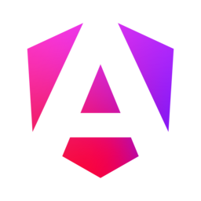 | `from resources.programming.framework import Angular` |
|  | `from resources.programming.framework import Flutter` |
|  | `from resources.programming.framework import Starlette` |
|  | `from resources.programming.framework import Django` |
| 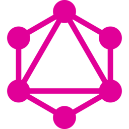 | `from resources.programming.framework import Graphql` |
|  | `from resources.programming.framework import Ember` |
|  | `from resources.programming.language import Latex` |
|  | `from resources.programming.language import Nodejs` |
|  | `from resources.programming.language import Matlab` |
|  | `from resources.programming.language import Scala` |
|  | `from resources.programming.language import R` |
|  | `from resources.programming.language import Java` |
|  | `from resources.programming.language import Python` |
| 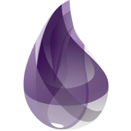 | `from resources.programming.language import Elixir` |
|  | `from resources.programming.language import Cpp` |
|  | `from resources.programming.language import Php` |
|  | `from resources.programming.language import C` |
|  | `from resources.programming.language import Csharp` |
|  | `from resources.programming.language import Bash` |
|  | `from resources.programming.language import Kotlin` |
|  | `from resources.programming.language import Javascript` |
|  | `from resources.programming.language import Erlang` |
|  | `from resources.programming.language import Rust` |
|  | `from resources.programming.language import Dart` |
|  | `from resources.programming.language import Swift` |
|  | `from resources.programming.language import Ruby` |
|  | `from resources.programming.language import Typescript` |
|  | `from resources.programming.language import Go` |
|  | `from resources.programming.runtime import Dapr` |
|  | `from resources.openstack import Openstack` |
|  | `from resources.openstack.applicationlifecycle import Murano` |
|  | `from resources.openstack.applicationlifecycle import Freezer` |
|  | `from resources.openstack.applicationlifecycle import Masakari` |
|  | `from resources.openstack.applicationlifecycle import Solum` |
|  | `from resources.openstack.multiregion import Tricircle` |
|  | `from resources.openstack.sharedservices import Searchlight` |
|  | `from resources.openstack.sharedservices import Keystone` |
|  | `from resources.openstack.sharedservices import Karbor` |
|  | `from resources.openstack.sharedservices import Barbican` |
|  | `from resources.openstack.sharedservices import Glance` |
|  | `from resources.openstack.apiproxies import Ec2Api` |
|  | `from resources.openstack.user import Openstackclient` |
|  | `from resources.openstack.baremetal import Cyborg` |
|  | `from resources.openstack.baremetal import Ironic` |
|  | `from resources.openstack.monitoring import Telemetry` |
|  | `from resources.openstack.monitoring import Monasca` |
|  | `from resources.openstack.workloadprovisioning import Sahara` |
|  | `from resources.openstack.workloadprovisioning import Magnum` |
|  | `from resources.openstack.workloadprovisioning import Trove` |
|  | `from resources.openstack.compute import Qinling` |
|  | `from resources.openstack.compute import Nova` |
|  | `from resources.openstack.compute import Zun` |
|  | `from resources.openstack.orchestration import Zaqar` |
|  | `from resources.openstack.orchestration import Mistral` |
|  | `from resources.openstack.orchestration import Heat` |
|  | `from resources.openstack.orchestration import Blazar` |
|  | `from resources.openstack.orchestration import Senlin` |
|  | `from resources.openstack.deployment import Kolla` |
|  | `from resources.openstack.deployment import Charms` |
|  | `from resources.openstack.deployment import Helm` |
|  | `from resources.openstack.deployment import Ansible` |
|  | `from resources.openstack.deployment import Tripleo` |
|  | `from resources.openstack.deployment import Chef` |
|  | `from resources.openstack.storage import Cinder` |
|  | `from resources.openstack.storage import Manila` |
|  | `from resources.openstack.storage import Swift` |
|  | `from resources.openstack.frontend import Horizon` |
|  | `from resources.openstack.nfv import Tacker` |
|  | `from resources.openstack.billing import Cloudkitty` |
|  | `from resources.openstack.optimization import Watcher` |
|  | `from resources.openstack.optimization import Rally` |
|  | `from resources.openstack.optimization import Vitrage` |
|  | `from resources.openstack.optimization import Congress` |
|  | `from resources.openstack.networking import Octavia` |
|  | `from resources.openstack.networking import Neutron` |
|  | `from resources.openstack.networking import Designate` |
|  | `from resources.openstack.containerservices import Kuryr` |
|  | `from resources.openstack.packaging import Puppet` |
|  | `from resources.openstack.packaging import Loci` |
|  | `from resources.openstack.packaging import Rpm` |
|  | `from resources.k8s.group import Ns` |
|  | `from resources.k8s.others import Psp` |
|  | `from resources.k8s.others import Crd` |
|  | `from resources.k8s.network import Ing` |
|  | `from resources.k8s.network import Netpol` |
|  | `from resources.k8s.network import Ep` |
|  | `from resources.k8s.network import Svc` |
|  | `from resources.k8s.clusterconfig import Quota` |
|  | `from resources.k8s.clusterconfig import Hpa` |
|  | `from resources.k8s.clusterconfig import Limits` |
|  | `from resources.k8s.podconfig import Cm` |
|  | `from resources.k8s.podconfig import Secret` |
|  | `from resources.k8s.compute import Cronjob` |
|  | `from resources.k8s.compute import Job` |
|  | `from resources.k8s.compute import Rs` |
|  | `from resources.k8s.compute import Sts` |
|  | `from resources.k8s.compute import Pod` |
|  | `from resources.k8s.compute import Ds` |
|  | `from resources.k8s.compute import Deploy` |
|  | `from resources.k8s.storage import Sc` |
|  | `from resources.k8s.storage import Pv` |
|  | `from resources.k8s.storage import Pvc` |
|  | `from resources.k8s.storage import Vol` |
|  | `from resources.k8s.infra import Etcd` |
|  | `from resources.k8s.infra import Node` |
|  | `from resources.k8s.infra import Master` |
|  | `from resources.k8s.rbac import User` |
|  | `from resources.k8s.rbac import Sa` |
|  | `from resources.k8s.rbac import Rb` |
|  | `from resources.k8s.rbac import CRole` |
|  | `from resources.k8s.rbac import Crb` |
|  | `from resources.k8s.rbac import Role` |
|  | `from resources.k8s.rbac import Group` |
|  | `from resources.k8s.ecosystem import ExternalDns` |
|  | `from resources.k8s.ecosystem import Kustomize` |
|  | `from resources.k8s.ecosystem import Krew` |
|  | `from resources.k8s.ecosystem import Helm` |
|  | `from resources.k8s.chaos import ChaosMesh` |
|  | `from resources.k8s.chaos import LitmusChaos` |
|  | `from resources.k8s.controlplane import Kubelet` |
|  | `from resources.k8s.controlplane import CCM` |
|  | `from resources.k8s.controlplane import CM` |
|  | `from resources.k8s.controlplane import KProxy` |
|  | `from resources.k8s.controlplane import Sched` |
|  | `from resources.k8s.controlplane import Api` |
|  | `from resources.onprem.queue import Nats` |
|  | `from resources.onprem.queue import Rabbitmq` |
|  | `from resources.onprem.queue import Kafka` |
|  | `from resources.onprem.queue import Activemq` |
|  | `from resources.onprem.queue import Celery` |
|  | `from resources.onprem.queue import Zeromq` |
|  | `from resources.onprem.mlops import Polyaxon` |
|  | `from resources.onprem.iac import Atlantis` |
|  | `from resources.onprem.iac import Puppet` |
|  | `from resources.onprem.iac import Terraform` |
|  | `from resources.onprem.iac import Ansible` |
|  | `from resources.onprem.iac import Awx` |
|  | `from resources.onprem.inmemory import Memcached` |
|  | `from resources.onprem.inmemory import Redis` |
|  | `from resources.onprem.inmemory import Hazelcast` |
|  | `from resources.onprem.inmemory import Aerospike` |
|  | `from resources.onprem.aggregator import Vector` |
|  | `from resources.onprem.aggregator import Fluentd` |
|  | `from resources.onprem.vcs import Gitea` |
|  | `from resources.onprem.vcs import Svn` |
|  | `from resources.onprem.vcs import Gitlab` |
|  | `from resources.onprem.vcs import Git` |
|  | `from resources.onprem.vcs import Github` |
|  | `from resources.onprem.network import Pfsense` |
|  | `from resources.onprem.network import Internet` |
|  | `from resources.onprem.network import Haproxy` |
|  | `from resources.onprem.network import Kong` |
|  | `from resources.onprem.network import Opnsense` |
|  | `from resources.onprem.network import Etcd` |
|  | `from resources.onprem.network import Tyk` |
|  | `from resources.onprem.network import Vyos` |
|  | `from resources.onprem.network import Powerdns` |
|  | `from resources.onprem.network import Jbossas` |
|  | `from resources.onprem.network import Glassfish` |
|  | `from resources.onprem.network import Traefik` |
|  | `from resources.onprem.network import Ambassador` |
|  | `from resources.onprem.network import Gunicorn` |
|  | `from resources.onprem.network import Jetty` |
|  | `from resources.onprem.network import Pomerium` |
|  | `from resources.onprem.network import Wildfly` |
|  | `from resources.onprem.network import Consul` |
|  | `from resources.onprem.network import Nginx` |
|  | `from resources.onprem.network import Apache` |
| 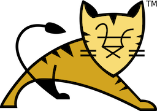 | `from resources.onprem.network import Tomcat` |
|  | `from resources.onprem.network import OpenServiceMesh` |
|  | `from resources.onprem.network import Bind9` |
|  | `from resources.onprem.network import Caddy` |
|  | `from resources.onprem.network import Ocelot` |
|  | `from resources.onprem.network import Linkerd` |
|  | `from resources.onprem.network import Istio` |
|  | `from resources.onprem.network import Envoy` |
|  | `from resources.onprem.network import Zookeeper` |
|  | `from resources.onprem.security import Vault` |
|  | `from resources.onprem.security import Trivy` |
|  | `from resources.onprem.security import Bitwarden` |
|  | `from resources.onprem.dns import Coredns` |
|  | `from resources.onprem.dns import Powerdns` |
|  | `from resources.onprem.database import Scylla` |
|  | `from resources.onprem.database import Janusgraph` |
|  | `from resources.onprem.database import Druid` |
|  | `from resources.onprem.database import Dgraph` |
|  | `from resources.onprem.database import Mysql` |
|  | `from resources.onprem.database import Clickhouse` |
|  | `from resources.onprem.database import Neo4J` |
|  | `from resources.onprem.database import Couchdb` |
|  | `from resources.onprem.database import Influxdb` |
|  | `from resources.onprem.database import Postgresql` |
|  | `from resources.onprem.database import Cassandra` |
|  | `from resources.onprem.database import Oracle` |
|  | `from resources.onprem.database import Cockroachdb` |
|  | `from resources.onprem.database import Couchbase` |
|  | `from resources.onprem.database import Mssql` |
|  | `from resources.onprem.database import Mariadb` |
|  | `from resources.onprem.database import Mongodb` |
|  | `from resources.onprem.database import Hbase` |
|  | `from resources.onprem.search import Solr` |
|  | `from resources.onprem.workflow import Nifi` |
|  | `from resources.onprem.workflow import Kubeflow` |
|  | `from resources.onprem.workflow import Airflow` |
|  | `from resources.onprem.workflow import Digdag` |
|  | `from resources.onprem.monitoring import Humio` |
|  | `from resources.onprem.monitoring import Grafana` |
|  | `from resources.onprem.monitoring import PrometheusOperator` |
|  | `from resources.onprem.monitoring import Splunk` |
|  | `from resources.onprem.monitoring import Prometheus` |
|  | `from resources.onprem.monitoring import Sentry` |
|  | `from resources.onprem.monitoring import Cortex` |
|  | `from resources.onprem.monitoring import Newrelic` |
| 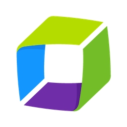 | `from resources.onprem.monitoring import Dynatrace` |
|  | `from resources.onprem.monitoring import Nagios` |
|  | `from resources.onprem.monitoring import Thanos` |
|  | `from resources.onprem.monitoring import Zabbix` |
|  | `from resources.onprem.monitoring import Datadog` |
|  | `from resources.onprem.container import K3S` |
|  | `from resources.onprem.container import Crio` |
|  | `from resources.onprem.container import Containerd` |
|  | `from resources.onprem.container import Rkt` |
|  | `from resources.onprem.container import Lxc` |
|  | `from resources.onprem.container import Gvisor` |
|  | `from resources.onprem.container import Firecracker` |
| 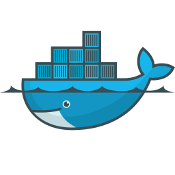 | `from resources.onprem.container import Docker` |
|  | `from resources.onprem.gitops import Flagger` |
|  | `from resources.onprem.gitops import Flux` |
|  | `from resources.onprem.gitops import Argocd` |
|  | `from resources.onprem.logging import SyslogNg` |
|  | `from resources.onprem.logging import Rsyslog` |
|  | `from resources.onprem.logging import Graylog` |
|  | `from resources.onprem.logging import Loki` |
|  | `from resources.onprem.logging import Fluentbit` |
|  | `from resources.onprem.compute import Nomad` |
|  | `from resources.onprem.compute import Server` |
|  | `from resources.onprem.etl import Embulk` |
|  | `from resources.onprem.tracing import Jaeger` |
|  | `from resources.onprem.certificates import LetsEncrypt` |
|  | `from resources.onprem.certificates import CertManager` |
|  | `from resources.onprem.proxmox import Pve` |
|  | `from resources.onprem.auth import BuzzfeedSso` |
|  | `from resources.onprem.auth import Oauth2Proxy` |
|  | `from resources.onprem.auth import Boundary` |
|  | `from resources.onprem.analytics import Norikra` |
|  | `from resources.onprem.analytics import Storm` |
|  | `from resources.onprem.analytics import Beam` |
|  | `from resources.onprem.analytics import Metabase` |
|  | `from resources.onprem.analytics import Spark` |
|  | `from resources.onprem.analytics import Singer` |
|  | `from resources.onprem.analytics import Presto` |
|  | `from resources.onprem.analytics import Tableau` |
|  | `from resources.onprem.analytics import Powerbi` |
|  | `from resources.onprem.analytics import Databricks` |
|  | `from resources.onprem.analytics import Superset` |
|  | `from resources.onprem.analytics import Hadoop` |
|  | `from resources.onprem.analytics import Dremio` |
|  | `from resources.onprem.analytics import Dbt` |
|  | `from resources.onprem.analytics import Flink` |
|  | `from resources.onprem.analytics import Hive` |
|  | `from resources.onprem.storage import CephOsd` |
|  | `from resources.onprem.storage import Ceph` |
|  | `from resources.onprem.storage import Glusterfs` |
|  | `from resources.onprem.identity import Dex` |
|  | `from resources.onprem.groupware import Nextcloud` |
|  | `from resources.onprem.ci import Travisci` |
|  | `from resources.onprem.ci import Concourseci` |
|  | `from resources.onprem.ci import Zuulci` |
|  | `from resources.onprem.ci import Circleci` |
|  | `from resources.onprem.ci import Jenkins` |
|  | `from resources.onprem.ci import Gitlabci` |
|  | `from resources.onprem.ci import Teamcity` |
|  | `from resources.onprem.ci import Droneci` |
|  | `from resources.onprem.ci import GithubActions` |
|  | `from resources.onprem.cd import Tekton` |
|  | `from resources.onprem.cd import TektonCli` |
|  | `from resources.onprem.cd import Spinnaker` |
|  | `from resources.onprem.client import User` |
|  | `from resources.onprem.client import Client` |
|  | `from resources.onprem.client import Users` |
|  | `from resources.digitalocean.network import Firewall` |
|  | `from resources.digitalocean.network import FloatingIp` |
|  | `from resources.digitalocean.network import Vpc` |
|  | `from resources.digitalocean.network import InternetGateway` |
|  | `from resources.digitalocean.network import Domain` |
|  | `from resources.digitalocean.network import LoadBalancer` |
|  | `from resources.digitalocean.network import DomainRegistration` |
|  | `from resources.digitalocean.network import ManagedVpn` |
|  | `from resources.digitalocean.network import Certificate` |
|  | `from resources.digitalocean.database import DbaasPrimary` |
|  | `from resources.digitalocean.database import DbaasReadOnly` |
|  | `from resources.digitalocean.database import DbaasPrimaryStandbyMore` |
|  | `from resources.digitalocean.database import DbaasStandby` |
|  | `from resources.digitalocean.compute import K8SNode` |
|  | `from resources.digitalocean.compute import Containers` |
|  | `from resources.digitalocean.compute import DropletSnapshot` |
|  | `from resources.digitalocean.compute import K8SNodePool` |
|  | `from resources.digitalocean.compute import Droplet` |
|  | `from resources.digitalocean.compute import K8SCluster` |
|  | `from resources.digitalocean.compute import DropletConnect` |
|  | `from resources.digitalocean.compute import Docker` |
|  | `from resources.digitalocean.storage import Volume` |
|  | `from resources.digitalocean.storage import VolumeSnapshot` |
|  | `from resources.digitalocean.storage import Space` |
|  | `from resources.digitalocean.storage import Folder` |
|  | `from resources.firebase.extentions import Extensions` |
|  | `from resources.firebase.grow import InAppMessaging` |
|  | `from resources.firebase.grow import AppIndexing` |
|  | `from resources.firebase.grow import RemoteConfig` |
|  | `from resources.firebase.grow import AbTesting` |
|  | `from resources.firebase.grow import DynamicLinks` |
|  | `from resources.firebase.grow import Invites` |
|  | `from resources.firebase.grow import Messaging` |
|  | `from resources.firebase.grow import Predictions` |
|  | `from resources.firebase.quality import TestLab` |
|  | `from resources.firebase.quality import CrashReporting` |
|  | `from resources.firebase.quality import Crashlytics` |
|  | `from resources.firebase.quality import AppDistribution` |
|  | `from resources.firebase.quality import PerformanceMonitoring` |
|  | `from resources.firebase.base import Firebase` |
|  | `from resources.firebase.develop import Functions` |
|  | `from resources.firebase.develop import Hosting` |
|  | `from resources.firebase.develop import Authentication` |
|  | `from resources.firebase.develop import MlKit` |
|  | `from resources.firebase.develop import RealtimeDatabase` |
|  | `from resources.firebase.develop import Storage` |
|  | `from resources.firebase.develop import Firestore` |
|  | `from resources.oci.devops import ResourceMgmtWhite` |
|  | `from resources.oci.devops import ApiServiceWhite` |
|  | `from resources.oci.devops import ApiGateway` |
|  | `from resources.oci.devops import ApiService` |
|  | `from resources.oci.devops import ApiGatewayWhite` |
|  | `from resources.oci.devops import ResourceMgmt` |
|  | `from resources.oci.network import VcnWhite` |
|  | `from resources.oci.network import LoadBalancerWhite` |
|  | `from resources.oci.network import SecurityListsWhite` |
|  | `from resources.oci.network import RouteTableWhite` |
|  | `from resources.oci.network import InternetGatewayWhite` |
|  | `from resources.oci.network import ServiceGateway` |
|  | `from resources.oci.network import Drg` |
|  | `from resources.oci.network import Vcn` |
|  | `from resources.oci.network import Firewall` |
|  | `from resources.oci.network import ServiceGatewayWhite` |
|  | `from resources.oci.network import InternetGateway` |
| 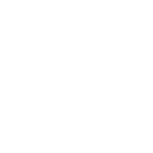 | `from resources.oci.network import DrgWhite` |
|  | `from resources.oci.network import FirewallWhite` |
|  | `from resources.oci.network import SecurityLists` |
|  | `from resources.oci.network import LoadBalancer` |
|  | `from resources.oci.network import RouteTable` |
|  | `from resources.oci.security import IdAccess` |
|  | `from resources.oci.security import EncryptionWhite` |
|  | `from resources.oci.security import Vault` |
| 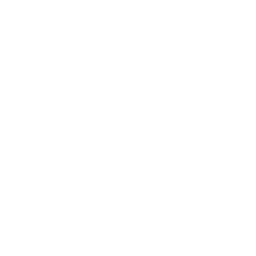 | `from resources.oci.security import DdosWhite` |
|  | `from resources.oci.security import Waf` |
|  | `from resources.oci.security import KeyManagement` |
|  | `from resources.oci.security import Ddos` |
|  | `from resources.oci.security import MaxSecurityZoneWhite` |
|  | `from resources.oci.security import VaultWhite` |
|  | `from resources.oci.security import WafWhite` |
|  | `from resources.oci.security import Encryption` |
|  | `from resources.oci.security import CloudGuardWhite` |
|  | `from resources.oci.security import IdAccessWhite` |
|  | `from resources.oci.security import CloudGuard` |
|  | `from resources.oci.security import MaxSecurityZone` |
|  | `from resources.oci.security import KeyManagementWhite` |
|  | `from resources.oci.connectivity import CustomerPremise` |
|  | `from resources.oci.connectivity import Dns` |
|  | `from resources.oci.connectivity import VpnWhite` |
|  | `from resources.oci.connectivity import Cdn` |
|  | `from resources.oci.connectivity import DisconnectedRegionsWhite` |
|  | `from resources.oci.connectivity import BackboneWhite` |
|  | `from resources.oci.connectivity import CdnWhite` |
|  | `from resources.oci.connectivity import FastConnectWhite` |
|  | `from resources.oci.connectivity import Backbone` |
|  | `from resources.oci.connectivity import Vpn` |
|  | `from resources.oci.connectivity import CustomerPremiseWhite` |
|  | `from resources.oci.connectivity import CustomerDatacntrWhite` |
|  | `from resources.oci.connectivity import DnsWhite` |
|  | `from resources.oci.connectivity import FastConnect` |
|  | `from resources.oci.connectivity import CustomerDatacenter` |
|  | `from resources.oci.connectivity import NatGateway` |
|  | `from resources.oci.connectivity import NatGatewayWhite` |
|  | `from resources.oci.connectivity import DisconnectedRegions` |
| 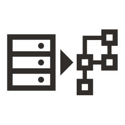 | `from resources.oci.database import Dms` |
|  | `from resources.oci.database import DatabaseServiceWhite` |
|  | `from resources.oci.database import DmsWhite` |
|  | `from resources.oci.database import AutonomousWhite` |
|  | `from resources.oci.database import BigdataServiceWhite` |
|  | `from resources.oci.database import ScienceWhite` |
|  | `from resources.oci.database import DatabaseService` |
|  | `from resources.oci.database import Science` |
|  | `from resources.oci.database import DcatWhite` |
|  | `from resources.oci.database import StreamWhite` |
|  | `from resources.oci.database import DisWhite` |
|  | `from resources.oci.database import BigdataService` |
|  | `from resources.oci.database import Autonomous` |
|  | `from resources.oci.database import DataflowApache` |
|  | `from resources.oci.database import DataflowApacheWhite` |
|  | `from resources.oci.database import Stream` |
|  | `from resources.oci.database import Dcat` |
|  | `from resources.oci.database import Dis` |
|  | `from resources.oci.monitoring import Alarm` |
|  | `from resources.oci.monitoring import QueueWhite` |
|  | `from resources.oci.monitoring import NotificationsWhite` |
|  | `from resources.oci.monitoring import Queue` |
|  | `from resources.oci.monitoring import Search` |
|  | `from resources.oci.monitoring import Notifications` |
| 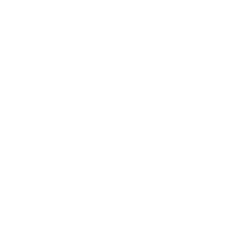 | `from resources.oci.monitoring import AlarmWhite` |
|  | `from resources.oci.monitoring import Events` |
|  | `from resources.oci.monitoring import Telemetry` |
|  | `from resources.oci.monitoring import EventsWhite` |
|  | `from resources.oci.monitoring import Workflow` |
|  | `from resources.oci.monitoring import EmailWhite` |
|  | `from resources.oci.monitoring import WorkflowWhite` |
|  | `from resources.oci.monitoring import SearchWhite` |
|  | `from resources.oci.monitoring import HealthCheck` |
|  | `from resources.oci.monitoring import TelemetryWhite` |
|  | `from resources.oci.monitoring import Email` |
|  | `from resources.oci.monitoring import HealthCheckWhite` |
| 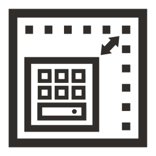 | `from resources.oci.compute import Autoscale` |
|  | `from resources.oci.compute import Bm` |
|  | `from resources.oci.compute import Functions` |
|  | `from resources.oci.compute import Ocir` |
|  | `from resources.oci.compute import ContainerWhite` |
|  | `from resources.oci.compute import Oke` |
|  | `from resources.oci.compute import OkeWhite` |
|  | `from resources.oci.compute import InstancePoolsWhite` |
|  | `from resources.oci.compute import AutoscaleWhite` |
|  | `from resources.oci.compute import Vm` |
|  | `from resources.oci.compute import Container` |
|  | `from resources.oci.compute import BmWhite` |
|  | `from resources.oci.compute import InstancePools` |
|  | `from resources.oci.compute import OcirWhite` |
|  | `from resources.oci.compute import FunctionsWhite` |
|  | `from resources.oci.compute import VmWhite` |
|  | `from resources.oci.governance import Logging` |
|  | `from resources.oci.governance import CompartmentsWhite` |
|  | `from resources.oci.governance import GroupsWhite` |
|  | `from resources.oci.governance import OcidWhite` |
|  | `from resources.oci.governance import Compartments` |
|  | `from resources.oci.governance import TaggingWhite` |
|  | `from resources.oci.governance import Tagging` |
|  | `from resources.oci.governance import Groups` |
|  | `from resources.oci.governance import LoggingWhite` |
|  | `from resources.oci.governance import Policies` |
|  | `from resources.oci.governance import Audit` |
|  | `from resources.oci.governance import Ocid` |
|  | `from resources.oci.governance import AuditWhite` |
|  | `from resources.oci.governance import PoliciesWhite` |
|  | `from resources.oci.storage import ObjectStorageWhite` |
|  | `from resources.oci.storage import BackupRestoreWhite` |
|  | `from resources.oci.storage import BucketsWhite` |
|  | `from resources.oci.storage import DataTransfer` |
| 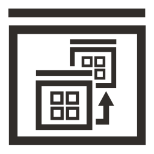 | `from resources.oci.storage import BlockStorageClone` |
|  | `from resources.oci.storage import StorageGateway` |
|  | `from resources.oci.storage import BackupRestore` |
|  | `from resources.oci.storage import FileStorageWhite` |
|  | `from resources.oci.storage import FileStorage` |
|  | `from resources.oci.storage import BlockStorageWhite` |
|  | `from resources.oci.storage import BlockStorageCloneWhite` |
|  | `from resources.oci.storage import StorageGatewayWhite` |
|  | `from resources.oci.storage import ElasticPerformance` |
|  | `from resources.oci.storage import ElasticPerformanceWhite` |
|  | `from resources.oci.storage import DataTransferWhite` |
|  | `from resources.oci.storage import ObjectStorage` |
| 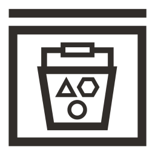 | `from resources.oci.storage import Buckets` |
|  | `from resources.oci.storage import BlockStorage` |
| 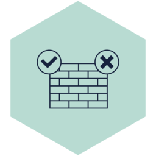 | `from resources.outscale.network import Net` |
|  | `from resources.outscale.network import NatService` |
|  | `from resources.outscale.network import LoadBalancer` |
|  | `from resources.outscale.network import SiteToSiteVpng` |
|  | `from resources.outscale.network import ClientVpn` |
|  | `from resources.outscale.network import InternetService` |
|  | `from resources.outscale.security import IdentityAndAccessManagement` |
|  | `from resources.outscale.security import Firewall` |
|  | `from resources.outscale.compute import DirectConnect` |
|  | `from resources.outscale.compute import Compute` |
|  | `from resources.outscale.storage import SimpleStorageService` |
|  | `from resources.outscale.storage import Storage` |
|  | `from resources.elastic.elasticsearch import Kibana` |
|  | `from resources.elastic.elasticsearch import SecuritySettings` |
|  | `from resources.elastic.elasticsearch import Monitoring` |
|  | `from resources.elastic.elasticsearch import MachineLearning` |
|  | `from resources.elastic.elasticsearch import Logstash` |
|  | `from resources.elastic.elasticsearch import Alerting` |
|  | `from resources.elastic.elasticsearch import Sql` |
|  | `from resources.elastic.elasticsearch import Beats` |
|  | `from resources.elastic.elasticsearch import Maps` |
|  | `from resources.elastic.elasticsearch import Elasticsearch` |
|  | `from resources.elastic.saas import Elastic` |
|  | `from resources.elastic.saas import Cloud` |
|  | `from resources.elastic.observability import Apm` |
|  | `from resources.elastic.observability import Uptime` |
| 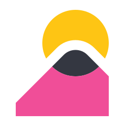 | `from resources.elastic.observability import Metrics` |
|  | `from resources.elastic.observability import Logs` |
|  | `from resources.elastic.observability import Observability` |
|  | `from resources.elastic.security import Endpoint` |
|  | `from resources.elastic.security import Security` |
|  | `from resources.elastic.security import Siem` |
|  | `from resources.elastic.enterprisesearch import WorkplaceSearch` |
|  | `from resources.elastic.enterprisesearch import SiteSearch` |
|  | `from resources.elastic.enterprisesearch import AppSearch` |
|  | `from resources.elastic.enterprisesearch import EnterpriseSearch` |
|  | `from resources.elastic.orchestration import Ece` |
|  | `from resources.elastic.orchestration import Eck` |
|  | `from resources.ibm.devops import ContinuousTesting` |
|  | `from resources.ibm.devops import BuildTest` |
|  | `from resources.ibm.devops import Provision` |
|  | `from resources.ibm.devops import ReleaseManagement` |
|  | `from resources.ibm.devops import ConfigurationManagement` |
|  | `from resources.ibm.devops import CollaborativeDevelopment` |
|  | `from resources.ibm.devops import ArtifactManagement` |
|  | `from resources.ibm.devops import ContinuousDeploy` |
|  | `from resources.ibm.devops import Devops` |
|  | `from resources.ibm.devops import CodeEditor` |
|  | `from resources.ibm.data import DataServices` |
|  | `from resources.ibm.data import FileRepository` |
|  | `from resources.ibm.data import DeviceIdentityService` |
|  | `from resources.ibm.data import Caches` |
|  | `from resources.ibm.data import DeviceRegistry` |
|  | `from resources.ibm.data import GroundTruth` |
|  | `from resources.ibm.data import EnterpriseData` |
|  | `from resources.ibm.data import EnterpriseUserDirectory` |
|  | `from resources.ibm.data import Model` |
|  | `from resources.ibm.data import Cloud` |
|  | `from resources.ibm.data import TmsDataInterface` |
|  | `from resources.ibm.data import ConversationTrainedDeployed` |
|  | `from resources.ibm.data import DataSources` |
|  | `from resources.ibm.network import LoadBalancingRouting` |
|  | `from resources.ibm.network import Subnet` |
|  | `from resources.ibm.network import Gateway` |
|  | `from resources.ibm.network import Enterprise` |
|  | `from resources.ibm.network import Router` |
|  | `from resources.ibm.network import VpnPolicy` |
|  | `from resources.ibm.network import PublicGateway` |
|  | `from resources.ibm.network import Bridge` |
|  | `from resources.ibm.network import Rules` |
|  | `from resources.ibm.network import VpnGateway` |
|  | `from resources.ibm.network import Firewall` |
|  | `from resources.ibm.network import FloatingIp` |
|  | `from resources.ibm.network import Vpc` |
|  | `from resources.ibm.network import TransitGateway` |
|  | `from resources.ibm.network import DirectLink` |
|  | `from resources.ibm.network import LoadBalancerPool` |
|  | `from resources.ibm.network import VpnConnection` |
|  | `from resources.ibm.network import LoadBalancer` |
|  | `from resources.ibm.network import Region` |
|  | `from resources.ibm.network import LoadBalancerListener` |
|  | `from resources.ibm.network import InternetServices` |
|  | `from resources.ibm.security import SecurityServices` |
|  | `from resources.ibm.security import Gateway` |
|  | `from resources.ibm.security import TrustendComputing` |
|  | `from resources.ibm.security import InfrastructureSecurity` |
|  | `from resources.ibm.security import GovernanceRiskCompliance` |
|  | `from resources.ibm.security import Firewall` |
|  | `from resources.ibm.security import Vpn` |
|  | `from resources.ibm.security import BlockchainSecurityService` |
|  | `from resources.ibm.security import IdentityProvider` |
|  | `from resources.ibm.security import IdentityAccessManagement` |
|  | `from resources.ibm.security import SecurityMonitoringIntelligence` |
|  | `from resources.ibm.security import ApiSecurity` |
|  | `from resources.ibm.security import DataSecurity` |
|  | `from resources.ibm.security import PhysicalSecurity` |
|  | `from resources.ibm.blockchain import BlockchainDeveloper` |
|  | `from resources.ibm.blockchain import Communication` |
|  | `from resources.ibm.blockchain import KeyManagement` |
|  | `from resources.ibm.blockchain import ClientApplication` |
|  | `from resources.ibm.blockchain import Node` |
|  | `from resources.ibm.blockchain import Services` |
|  | `from resources.ibm.blockchain import TransactionManager` |
|  | `from resources.ibm.blockchain import Wallet` |
|  | `from resources.ibm.blockchain import Event` |
|  | `from resources.ibm.blockchain import EventListener` |
|  | `from resources.ibm.blockchain import MessageBus` |
|  | `from resources.ibm.blockchain import CertificateAuthority` |
|  | `from resources.ibm.blockchain import Consensus` |
|  | `from resources.ibm.blockchain import Ledger` |
|  | `from resources.ibm.blockchain import Membership` |
|  | `from resources.ibm.blockchain import SmartContract` |
|  | `from resources.ibm.blockchain import HyperledgerFabric` |
|  | `from resources.ibm.blockchain import MembershipServicesProviderApi` |
|  | `from resources.ibm.blockchain import Blockchain` |
|  | `from resources.ibm.blockchain import ExistingEnterpriseSystems` |
|  | `from resources.ibm.user import User` |
|  | `from resources.ibm.user import Browser` |
|  | `from resources.ibm.user import Sensor` |
|  | `from resources.ibm.user import IntegratedDigitalExperiences` |
|  | `from resources.ibm.user import Device` |
|  | `from resources.ibm.user import PhysicalEntity` |
|  | `from resources.ibm.management import CloudManagement` |
|  | `from resources.ibm.management import ApiManagement` |
|  | `from resources.ibm.management import DataServices` |
|  | `from resources.ibm.management import MonitoringMetrics` |
|  | `from resources.ibm.management import ClusterManagement` |
|  | `from resources.ibm.management import DeviceManagement` |
|  | `from resources.ibm.management import ContentManagement` |
|  | `from resources.ibm.management import AlertNotification` |
|  | `from resources.ibm.management import ServiceManagementTools` |
|  | `from resources.ibm.management import PushNotifications` |
|  | `from resources.ibm.management import ItServiceManagement` |
|  | `from resources.ibm.management import Management` |
|  | `from resources.ibm.management import ProcessManagement` |
|  | `from resources.ibm.management import ProviderCloudPortalService` |
|  | `from resources.ibm.management import InformationGovernance` |
|  | `from resources.ibm.applications import MobileApp` |
|  | `from resources.ibm.applications import ApplicationLogic` |
|  | `from resources.ibm.applications import AppServer` |
|  | `from resources.ibm.applications import VisualRecognition` |
|  | `from resources.ibm.applications import Index` |
|  | `from resources.ibm.applications import SaasApplications` |
|  | `from resources.ibm.applications import ActionableInsight` |
|  | `from resources.ibm.applications import Annotate` |
|  | `from resources.ibm.applications import IotApplication` |
|  | `from resources.ibm.applications import ApiPolyglotRuntimes` |
|  | `from resources.ibm.applications import RuntimeServices` |
|  | `from resources.ibm.applications import Microservice` |
|  | `from resources.ibm.applications import ApiDeveloperPortal` |
|  | `from resources.ibm.applications import EnterpriseApplications` |
|  | `from resources.ibm.applications import Ontology` |
|  | `from resources.ibm.applications import OpenSourceTools` |
|  | `from resources.ibm.applications import SpeechToText` |
|  | `from resources.ibm.applications import ServiceBroker` |
|  | `from resources.ibm.applications import Visualization` |
|  | `from resources.ibm.compute import BareMetalServer` |
|  | `from resources.ibm.compute import PowerInstance` |
|  | `from resources.ibm.compute import Instance` |
|  | `from resources.ibm.compute import Key` |
|  | `from resources.ibm.compute import ImageService` |
|  | `from resources.ibm.analytics import Analytics` |
|  | `from resources.ibm.analytics import DataIntegration` |
|  | `from resources.ibm.analytics import DeviceAnalytics` |
|  | `from resources.ibm.analytics import DataRepositories` |
|  | `from resources.ibm.analytics import StreamingComputing` |
|  | `from resources.ibm.storage import ObjectStorage` |
|  | `from resources.ibm.storage import BlockStorage` |
|  | `from resources.ibm.general import Internet` |
|  | `from resources.ibm.general import Scalable` |
|  | `from resources.ibm.general import OfflineCapabilities` |
|  | `from resources.ibm.general import Cloudant` |
|  | `from resources.ibm.general import PeerCloud` |
|  | `from resources.ibm.general import MicroservicesMesh` |
|  | `from resources.ibm.general import Enterprise` |
|  | `from resources.ibm.general import IotCloud` |
|  | `from resources.ibm.general import InfrastructureSecurity` |
|  | `from resources.ibm.general import Openwhisk` |
|  | `from resources.ibm.general import MonitoringLogging` |
|  | `from resources.ibm.general import GovernanceRiskCompliance` |
|  | `from resources.ibm.general import Monitoring` |
|  | `from resources.ibm.general import IbmPublicCloud` |
|  | `from resources.ibm.general import IbmContainers` |
|  | `from resources.ibm.general import CloudServices` |
|  | `from resources.ibm.general import IdentityProvider` |
|  | `from resources.ibm.general import CognitiveServices` |
|  | `from resources.ibm.general import ObjectStorage` |
|  | `from resources.ibm.general import CloudMessaging` |
|  | `from resources.ibm.general import TransformationConnectivity` |
|  | `from resources.ibm.general import IdentityAccessManagement` |
|  | `from resources.ibm.general import TextToSpeech` |
|  | `from resources.ibm.general import RetrieveRank` |
|  | `from resources.ibm.general import DataSecurity` |
|  | `from resources.ibm.general import MicroservicesApplication` |
|  | `from resources.ibm.general import ServiceDiscoveryConfiguration` |
|  | `from resources.ibm.social import FileSync` |
|  | `from resources.ibm.social import Networking` |
|  | `from resources.ibm.social import Communities` |
|  | `from resources.ibm.social import LiveCollaboration` |
|  | `from resources.ibm.social import Messaging` |
|  | `from resources.ibm.infrastructure import LoadBalancingRouting` |
|  | `from resources.ibm.infrastructure import MobileBackend` |
|  | `from resources.ibm.infrastructure import MicroservicesMesh` |
|  | `from resources.ibm.infrastructure import Diagnostics` |
|  | `from resources.ibm.infrastructure import Dashboard` |
|  | `from resources.ibm.infrastructure import MonitoringLogging` |
|  | `from resources.ibm.infrastructure import Channels` |
|  | `from resources.ibm.infrastructure import Monitoring` |
|  | `from resources.ibm.infrastructure import PeerServices` |
|  | `from resources.ibm.infrastructure import EdgeServices` |
|  | `from resources.ibm.infrastructure import EventFeed` |
|  | `from resources.ibm.infrastructure import MobileProviderNetwork` |
|  | `from resources.ibm.infrastructure import InfrastructureServices` |
|  | `from resources.ibm.infrastructure import CloudMessaging` |
|  | `from resources.ibm.infrastructure import TransformationConnectivity` |
|  | `from resources.ibm.infrastructure import EnterpriseMessaging` |
|  | `from resources.ibm.infrastructure import InterserviceCommunication` |
|  | `from resources.ibm.infrastructure import ServiceDiscoveryConfiguration` |
|  | `from resources.gcp.iot import IotCore` |
|  | `from resources.gcp.migration import TransferAppliance` |
|  | `from resources.gcp.api import Endpoints` |
|  | `from resources.gcp.api import ApiGateway` |
|  | `from resources.gcp.operations import Monitoring` |
|  | `from resources.gcp.network import VirtualPrivateCloud` |
|  | `from resources.gcp.network import Armor` |
|  | `from resources.gcp.network import Nat` |
|  | `from resources.gcp.network import FirewallRules` |
|  | `from resources.gcp.network import Routes` |
|  | `from resources.gcp.network import Dns` |
|  | `from resources.gcp.network import Router` |
|  | `from resources.gcp.network import LoadBalancing` |
|  | `from resources.gcp.network import PartnerInterconnect` |
|  | `from resources.gcp.network import Cdn` |
|  | `from resources.gcp.network import StandardNetworkTier` |
|  | `from resources.gcp.network import ExternalIpAddresses` |
|  | `from resources.gcp.network import Network` |
|  | `from resources.gcp.network import Vpn` |
|  | `from resources.gcp.network import TrafficDirector` |
|  | `from resources.gcp.network import PremiumNetworkTier` |
|  | `from resources.gcp.network import DedicatedInterconnect` |
|  | `from resources.gcp.security import Iam` |
|  | `from resources.gcp.security import SecurityCommandCenter` |
|  | `from resources.gcp.security import ResourceManager` |
|  | `from resources.gcp.security import SecurityScanner` |
|  | `from resources.gcp.security import Iap` |
|  | `from resources.gcp.security import KeyManagementService` |
|  | `from resources.gcp.database import Spanner` |
|  | `from resources.gcp.database import Sql` |
|  | `from resources.gcp.database import Bigtable` |
|  | `from resources.gcp.database import Datastore` |
|  | `from resources.gcp.database import Memorystore` |
|  | `from resources.gcp.database import Firestore` |
|  | `from resources.gcp.compute import Functions` |
|  | `from resources.gcp.compute import KubernetesEngine` |
|  | `from resources.gcp.compute import ContainerOptimizedOs` |
|  | `from resources.gcp.compute import AppEngine` |
|  | `from resources.gcp.compute import ComputeEngine` |
|  | `from resources.gcp.compute import Gpu` |
|  | `from resources.gcp.compute import GkeOnPrem` |
|  | `from resources.gcp.compute import Run` |
|  | `from resources.gcp.devtools import SourceRepositories` |
|  | `from resources.gcp.devtools import TestLab` |
|  | `from resources.gcp.devtools import Tasks` |
|  | `from resources.gcp.devtools import ToolsForEclipse` |
|  | `from resources.gcp.devtools import Build` |
|  | `from resources.gcp.devtools import ToolsForPowershell` |
|  | `from resources.gcp.devtools import CodeForIntellij` |
|  | `from resources.gcp.devtools import ContainerRegistry` |
|  | `from resources.gcp.devtools import GradleAppEnginePlugin` |
|  | `from resources.gcp.devtools import Sdk` |
|  | `from resources.gcp.devtools import MavenAppEnginePlugin` |
|  | `from resources.gcp.devtools import ToolsForVisualStudio` |
|  | `from resources.gcp.devtools import IdePlugins` |
| 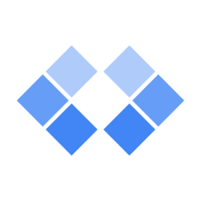 | `from resources.gcp.devtools import Code` |
|  | `from resources.gcp.devtools import Scheduler` |
|  | `from resources.gcp.analytics import Genomics` |
|  | `from resources.gcp.analytics import Dataproc` |
|  | `from resources.gcp.analytics import DataFusion` |
|  | `from resources.gcp.analytics import Dataprep` |
|  | `from resources.gcp.analytics import Bigquery` |
|  | `from resources.gcp.analytics import Pubsub` |
|  | `from resources.gcp.analytics import DataCatalog` |
|  | `from resources.gcp.analytics import Dataflow` |
|  | `from resources.gcp.analytics import Composer` |
|  | `from resources.gcp.analytics import Datalab` |
|  | `from resources.gcp.storage import Filestore` |
|  | `from resources.gcp.storage import PersistentDisk` |
|  | `from resources.gcp.storage import Storage` |
|  | `from resources.gcp.ml import Tpu` |
|  | `from resources.gcp.ml import JobsApi` |
|  | `from resources.gcp.ml import AiPlatformDataLabelingService` |
|  | `from resources.gcp.ml import TranslationApi` |
|  | `from resources.gcp.ml import AiPlatform` |
|  | `from resources.gcp.ml import AutomlTables` |
|  | `from resources.gcp.ml import AdvancedSolutionsLab` |
|  | `from resources.gcp.ml import NaturalLanguageApi` |
|  | `from resources.gcp.ml import AutomlNaturalLanguage` |
|  | `from resources.gcp.ml import AutomlVision` |
|  | `from resources.gcp.ml import AutomlTranslation` |
|  | `from resources.gcp.ml import VideoIntelligenceApi` |
|  | `from resources.gcp.ml import AutomlVideoIntelligence` |
| 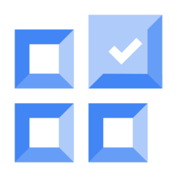 | `from resources.gcp.ml import RecommendationsAi` |
|  | `from resources.gcp.ml import DialogFlowEnterpriseEdition` |
|  | `from resources.gcp.ml import Automl` |
|  | `from resources.gcp.ml import InferenceApi` |
|  | `from resources.gcp.ml import TextToSpeech` |
|  | `from resources.gcp.ml import SpeechToText` |
|  | `from resources.gcp.ml import AiHub` |
|  | `from resources.gcp.ml import VisionApi` |
