# Diagrams Cheat Sheet
| Image | Python Import |
| ----- | ------------- |
|  | `from resources.aws.iot import iot_sitewise` |
| 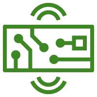 | `from resources.aws.iot import iot_hardware_board` |
|  | `from resources.aws.iot import iot_utility` |
|  | `from resources.aws.iot import iot_analytics_pipeline` |
|  | `from resources.aws.iot import iot_things_graph` |
|  | `from resources.aws.iot import iot_action` |
|  | `from resources.aws.iot import iot_reported_state` |
|  | `from resources.aws.iot import iot_topic` |
|  | `from resources.aws.iot import iot_greengrass` |
|  | `from resources.aws.iot import iot_certificate` |
|  | `from resources.aws.iot import iot_travel` |
|  | `from resources.aws.iot import iot_car` |
|  | `from resources.aws.iot import iot_door_lock` |
|  | `from resources.aws.iot import iot_alexa_enabled_device` |
|  | `from resources.aws.iot import iot_shadow` |
|  | `from resources.aws.iot import iot_thermostat` |
|  | `from resources.aws.iot import iot_generic` |
|  | `from resources.aws.iot import iot_events` |
|  | `from resources.aws.iot import iot_desired_state` |
|  | `from resources.aws.iot import iot_factory` |
|  | `from resources.aws.iot import freertos` |
|  | `from resources.aws.iot import iot_bank` |
|  | `from resources.aws.iot import iot_medical_emergency` |
|  | `from resources.aws.iot import iot_1_click` |
|  | `from resources.aws.iot import iot_http2` |
|  | `from resources.aws.iot import iot_analytics_notebook` |
|  | `from resources.aws.iot import iot_bicycle` |
|  | `from resources.aws.iot import iot_policy_emergency` |
|  | `from resources.aws.iot import iot_fire_tv_stick` |
|  | `from resources.aws.iot import iot_simulator` |
|  | `from resources.aws.iot import iot_policy` |
|  | `from resources.aws.iot import iot_device_gateway` |
|  | `from resources.aws.iot import iot_lambda` |
|  | `from resources.aws.iot import iot_windfarm` |
|  | `from resources.aws.iot import iot_rule` |
|  | `from resources.aws.iot import iot_button` |
|  | `from resources.aws.iot import iot_servo` |
|  | `from resources.aws.iot import iot_house` |
|  | `from resources.aws.iot import iot_greengrass_connector` |
|  | `from resources.aws.iot import iot_analytics_channel` |
|  | `from resources.aws.iot import iot_alexa_voice_service` |
|  | `from resources.aws.iot import iot_cart` |
|  | `from resources.aws.iot import iot_mqtt` |
|  | `from resources.aws.iot import iot_alexa_skill` |
|  | `from resources.aws.iot import iot_core` |
|  | `from resources.aws.iot import iot_alexa_echo` |
|  | `from resources.aws.iot import iot_camera` |
|  | `from resources.aws.iot import internet_of_things` |
|  | `from resources.aws.iot import iot_http` |
|  | `from resources.aws.iot import iot_analytics_data_store` |
|  | `from resources.aws.iot import iot_device_management` |
|  | `from resources.aws.iot import iot_sensor` |
|  | `from resources.aws.iot import iot_jobs` |
|  | `from resources.aws.iot import iot_lightbulb` |
|  | `from resources.aws.iot import iot_fire_tv` |
|  | `from resources.aws.iot import iot_coffee_pot` |
|  | `from resources.aws.iot import iot_device_defender` |
|  | `from resources.aws.iot import iot_analytics` |
|  | `from resources.aws.iot import iot_analytics_data_set` |
|  | `from resources.aws.iot import iot_actuator` |
|  | `from resources.aws.iot import iot_over_the_air_update` |
|  | `from resources.aws.satellite import satellite` |
|  | `from resources.aws.satellite import ground_station` |
|  | `from resources.aws.robotics import robomaker_fleet_management` |
|  | `from resources.aws.robotics import robomaker_cloud_extension_ros` |
|  | `from resources.aws.robotics import robomaker_simulator` |
|  | `from resources.aws.robotics import robomaker_development_environment` |
|  | `from resources.aws.robotics import robotics` |
|  | `from resources.aws.robotics import robomaker` |
|  | `from resources.aws.media import elastic_transcoder` |
|  | `from resources.aws.media import elemental_conductor` |
| 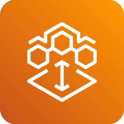 | `from resources.aws.media import elemental_mediaconnect` |
|  | `from resources.aws.media import elemental_mediastore` |
|  | `from resources.aws.media import elemental_mediaconvert` |
|  | `from resources.aws.media import media_services` |
| 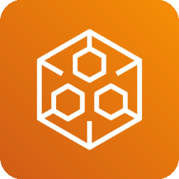 | `from resources.aws.media import elemental_mediapackage` |
|  | `from resources.aws.media import kinesis_video_streams` |
|  | `from resources.aws.media import elemental_medialive` |
|  | `from resources.aws.media import elemental_live` |
| 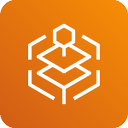 | `from resources.aws.media import elemental_mediatailor` |
|  | `from resources.aws.media import elemental_delta` |
|  | `from resources.aws.media import elemental_server` |
|  | `from resources.aws.cost import savings_plans` |
|  | `from resources.aws.cost import cost_and_usage_report` |
|  | `from resources.aws.cost import cost_explorer` |
|  | `from resources.aws.cost import reserved_instance_reporting` |
|  | `from resources.aws.cost import cost_management` |
|  | `from resources.aws.cost import budgets` |
|  | `from resources.aws.migration import datasync` |
|  | `from resources.aws.migration import database_migration_service` |
|  | `from resources.aws.migration import migration_and_transfer` |
| 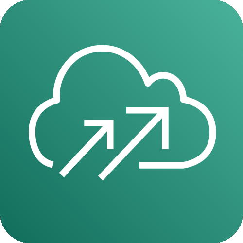 | `from resources.aws.migration import cloudendure_migration` |
|  | `from resources.aws.migration import snowmobile` |
|  | `from resources.aws.migration import server_migration_service` |
|  | `from resources.aws.migration import migration_hub` |
|  | `from resources.aws.migration import snowball` |
|  | `from resources.aws.migration import snowball_edge` |
|  | `from resources.aws.migration import datasync_agent` |
|  | `from resources.aws.migration import application_discovery_service` |
| 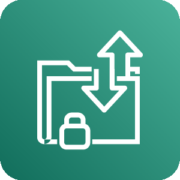 | `from resources.aws.migration import transfer_for_sftp` |
|  | `from resources.aws.mobile import pinpoint` |
|  | `from resources.aws.mobile import device_farm` |
|  | `from resources.aws.mobile import appsync` |
|  | `from resources.aws.mobile import api_gateway` |
| 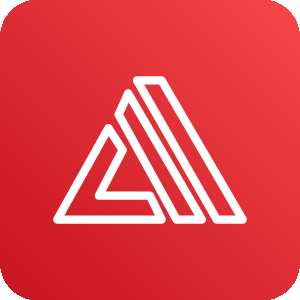 | `from resources.aws.mobile import amplify` |
|  | `from resources.aws.mobile import api_gateway_endpoint` |
|  | `from resources.aws.mobile import mobile` |
|  | `from resources.aws.business import business_applications` |
|  | `from resources.aws.business import workmail` |
|  | `from resources.aws.business import alexa_for_business` |
|  | `from resources.aws.business import chime` |
|  | `from resources.aws.network import public_subnet` |
|  | `from resources.aws.network import privatelink` |
|  | `from resources.aws.network import nacl` |
|  | `from resources.aws.network import vpc_elastic_network_interface` |
|  | `from resources.aws.network import global_accelerator` |
|  | `from resources.aws.network import elb_classic_load_balancer` |
|  | `from resources.aws.network import endpoint` |
|  | `from resources.aws.network import cloudfront_edge_location` |
|  | `from resources.aws.network import app_mesh` |
|  | `from resources.aws.network import cloudfront` |
|  | `from resources.aws.network import vpc_flow_logs` |
| 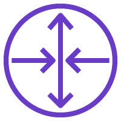 | `from resources.aws.network import vpc_router` |
|  | `from resources.aws.network import vpn_gateway` |
|  | `from resources.aws.network import vpc_peering` |
|  | `from resources.aws.network import vpc` |
|  | `from resources.aws.network import internet_gateway` |
|  | `from resources.aws.network import transit_gateway` |
|  | `from resources.aws.network import api_gateway` |
|  | `from resources.aws.network import cloudfront_streaming_distribution` |
|  | `from resources.aws.network import elb_network_load_balancer` |
|  | `from resources.aws.network import vpc_traffic_mirroring` |
|  | `from resources.aws.network import direct_connect` |
|  | `from resources.aws.network import route_53` |
|  | `from resources.aws.network import networking_and_content_delivery` |
|  | `from resources.aws.network import vpc_elastic_network_adapter` |
|  | `from resources.aws.network import vpn_connection` |
|  | `from resources.aws.network import api_gateway_endpoint` |
|  | `from resources.aws.network import cloud_map` |
|  | `from resources.aws.network import route_table` |
|  | `from resources.aws.network import vpc_customer_gateway` |
| 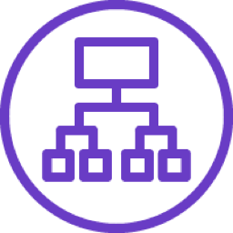 | `from resources.aws.network import elb_application_load_balancer` |
|  | `from resources.aws.network import site_to_site_vpn` |
|  | `from resources.aws.network import route_53_hosted_zone` |
|  | `from resources.aws.network import elastic_load_balancing` |
|  | `from resources.aws.network import client_vpn` |
|  | `from resources.aws.network import nat_gateway` |
|  | `from resources.aws.network import private_subnet` |
|  | `from resources.aws.network import cloudfront_download_distribution` |
|  | `from resources.aws.security import identity_and_access_management_iam_access_analyzer` |
|  | `from resources.aws.security import identity_and_access_management_iam_temporary_security_credential` |
|  | `from resources.aws.security import guardduty` |
|  | `from resources.aws.security import waf_filtering_rule` |
|  | `from resources.aws.security import identity_and_access_management_iam_mfa_token` |
|  | `from resources.aws.security import identity_and_access_management_iam` |
|  | `from resources.aws.security import detective` |
|  | `from resources.aws.security import cloudhsm` |
|  | `from resources.aws.security import certificate_manager` |
|  | `from resources.aws.security import security_hub_finding` |
|  | `from resources.aws.security import waf` |
|  | `from resources.aws.security import macie` |
|  | `from resources.aws.security import shield_advanced` |
|  | `from resources.aws.security import cloud_directory` |
|  | `from resources.aws.security import artifact` |
|  | `from resources.aws.security import shield` |
|  | `from resources.aws.security import simple_ad` |
|  | `from resources.aws.security import security_hub` |
|  | `from resources.aws.security import firewall_manager` |
|  | `from resources.aws.security import identity_and_access_management_iam_encrypted_data` |
|  | `from resources.aws.security import inspector` |
|  | `from resources.aws.security import inspector_agent` |
|  | `from resources.aws.security import security_identity_and_compliance` |
|  | `from resources.aws.security import managed_microsoft_ad` |
|  | `from resources.aws.security import identity_and_access_management_iam_aws_sts_alternate` |
|  | `from resources.aws.security import single_sign_on` |
|  | `from resources.aws.security import identity_and_access_management_iam_long_term_security_credential` |
|  | `from resources.aws.security import certificate_authority` |
|  | `from resources.aws.security import ad_connector` |
|  | `from resources.aws.security import identity_and_access_management_iam_permissions` |
|  | `from resources.aws.security import resource_access_manager` |
|  | `from resources.aws.security import identity_and_access_management_iam_role` |
|  | `from resources.aws.security import cognito` |
|  | `from resources.aws.security import identity_and_access_management_iam_data_encryption_key` |
|  | `from resources.aws.security import identity_and_access_management_iam_add_on` |
|  | `from resources.aws.security import identity_and_access_management_iam_aws_sts` |
|  | `from resources.aws.security import directory_service` |
|  | `from resources.aws.security import key_management_service` |
|  | `from resources.aws.security import secrets_manager` |
|  | `from resources.aws.database import elasticache` |
|  | `from resources.aws.database import elasticache_for_memcached` |
|  | `from resources.aws.database import database` |
|  | `from resources.aws.database import documentdb_mongodb_compatibility` |
|  | `from resources.aws.database import rds_mysql_instance` |
|  | `from resources.aws.database import database_migration_service` |
|  | `from resources.aws.database import aurora_instance` |
|  | `from resources.aws.database import rds_mariadb_instance` |
|  | `from resources.aws.database import dynamodb_items` |
| 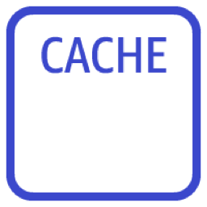 | `from resources.aws.database import elasticache_cache_node` |
|  | `from resources.aws.database import rds` |
|  | `from resources.aws.database import quantum_ledger_database_qldb` |
|  | `from resources.aws.database import dynamodb_global_secondary_index` |
|  | `from resources.aws.database import dynamodb_attribute` |
|  | `from resources.aws.database import keyspaces_managed_apache_cassandra_service` |
|  | `from resources.aws.database import timestream` |
|  | `from resources.aws.database import rds_on_vmware` |
|  | `from resources.aws.database import dynamodb_item` |
|  | `from resources.aws.database import neptune` |
|  | `from resources.aws.database import dynamodb_attributes` |
|  | `from resources.aws.database import rds_sql_server_instance` |
|  | `from resources.aws.database import dynamodb` |
| 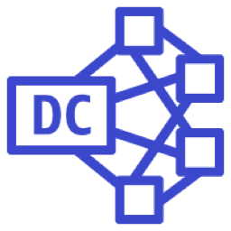 | `from resources.aws.database import redshift_dense_compute_node` |
|  | `from resources.aws.database import database_migration_service_database_migration_workflow` |
|  | `from resources.aws.database import rds_oracle_instance` |
|  | `from resources.aws.database import redshift_dense_storage_node` |
| 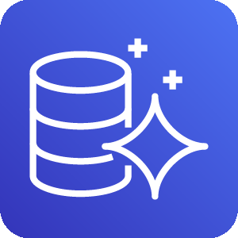 | `from resources.aws.database import aurora` |
| 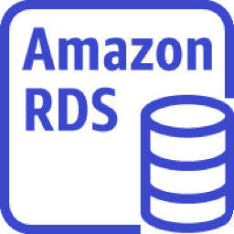 | `from resources.aws.database import rds_instance` |
|  | `from resources.aws.database import dynamodb_table` |
|  | `from resources.aws.database import elasticache_for_redis` |
|  | `from resources.aws.database import dynamodb_dax` |
|  | `from resources.aws.database import redshift` |
|  | `from resources.aws.database import rds_postgresql_instance` |
|  | `from resources.aws.blockchain import quantum_ledger_database_qldb` |
|  | `from resources.aws.blockchain import blockchain_resource` |
|  | `from resources.aws.blockchain import managed_blockchain` |
|  | `from resources.aws.blockchain import blockchain` |
|  | `from resources.aws.management import cloudformation_stack` |
|  | `from resources.aws.management import cloudformation_change_set` |
|  | `from resources.aws.management import cloudwatch_event_time_based` |
|  | `from resources.aws.management import opsworks_deployments` |
|  | `from resources.aws.management import command_line_interface` |
|  | `from resources.aws.management import trusted_advisor_checklist_cost` |
|  | `from resources.aws.management import systems_manager_patch_manager` |
|  | `from resources.aws.management import cloudtrail` |
|  | `from resources.aws.management import config` |
|  | `from resources.aws.management import opsworks_apps` |
|  | `from resources.aws.management import opsworks_resources` |
| 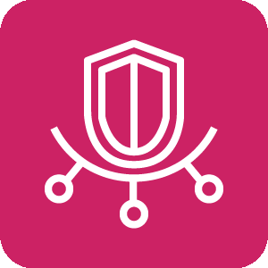 | `from resources.aws.management import trusted_advisor` |
|  | `from resources.aws.management import systems_manager` |
|  | `from resources.aws.management import systems_manager_automation` |
|  | `from resources.aws.management import systems_manager_state_manager` |
|  | `from resources.aws.management import systems_manager_run_command` |
|  | `from resources.aws.management import cloudwatch_event_event_based` |
|  | `from resources.aws.management import systems_manager_documents` |
|  | `from resources.aws.management import personal_health_dashboard` |
|  | `from resources.aws.management import opsworks_monitoring` |
|  | `from resources.aws.management import service_catalog` |
|  | `from resources.aws.management import cloudwatch_alarm` |
|  | `from resources.aws.management import opsworks_permissions` |
|  | `from resources.aws.management import systems_manager_parameter_store` |
|  | `from resources.aws.management import management_console` |
|  | `from resources.aws.management import codeguru` |
|  | `from resources.aws.management import cloudformation_template` |
|  | `from resources.aws.management import opsworks_layers` |
|  | `from resources.aws.management import organizations_organizational_unit` |
|  | `from resources.aws.management import control_tower` |
|  | `from resources.aws.management import opsworks_instances` |
|  | `from resources.aws.management import managed_services` |
|  | `from resources.aws.management import license_manager` |
|  | `from resources.aws.management import cloudwatch` |
|  | `from resources.aws.management import cloudwatch_rule` |
|  | `from resources.aws.management import well_architected_tool` |
|  | `from resources.aws.management import trusted_advisor_checklist_performance` |
|  | `from resources.aws.management import opsworks` |
|  | `from resources.aws.management import management_and_governance` |
|  | `from resources.aws.management import opsworks_stack` |
|  | `from resources.aws.management import trusted_advisor_checklist_security` |
|  | `from resources.aws.management import systems_manager_opscenter` |
|  | `from resources.aws.management import organizations` |
|  | `from resources.aws.management import chatbot` |
|  | `from resources.aws.management import cloudformation` |
|  | `from resources.aws.management import organizations_account` |
|  | `from resources.aws.management import systems_manager_maintenance_windows` |
|  | `from resources.aws.management import trusted_advisor_checklist` |
|  | `from resources.aws.management import trusted_advisor_checklist_fault_tolerant` |
|  | `from resources.aws.management import auto_scaling` |
|  | `from resources.aws.management import systems_manager_inventory` |
|  | `from resources.aws.ar import ar_vr` |
|  | `from resources.aws.ar import sumerian` |
|  | `from resources.aws.compute import ec2_elastic_ip_address` |
|  | `from resources.aws.compute import ec2_image_builder` |
|  | `from resources.aws.compute import serverless_application_repository` |
|  | `from resources.aws.compute import thinkbox_krakatoa_rounded` |
|  | `from resources.aws.compute import serverless_application_repository_rounded` |
|  | `from resources.aws.compute import thinkbox_sequoia_rounded` |
|  | `from resources.aws.compute import thinkbox_sequoia` |
|  | `from resources.aws.compute import elastic_beanstalk_application` |
|  | `from resources.aws.compute import thinkbox_frost` |
|  | `from resources.aws.compute import thinkbox_deadline` |
|  | `from resources.aws.compute import elastic_container_service_rounded` |
|  | `from resources.aws.compute import compute_rounded` |
|  | `from resources.aws.compute import thinkbox_xmesh_rounded` |
|  | `from resources.aws.compute import lambda_rounded` |
|  | `from resources.aws.compute import wavelength` |
|  | `from resources.aws.compute import ec2` |
|  | `from resources.aws.compute import elastic_container_service_service` |
|  | `from resources.aws.compute import ec2_ami` |
|  | `from resources.aws.compute import thinkbox_krakatoa` |
|  | `from resources.aws.compute import elastic_container_service_container` |
|  | `from resources.aws.compute import vmware_cloud_on_aws` |
|  | `from resources.aws.compute import elastic_kubernetes_service` |
|  | `from resources.aws.compute import ec2_container_registry_registry` |
|  | `from resources.aws.compute import batch_rounded` |
|  | `from resources.aws.compute import thinkbox_xmesh` |
|  | `from resources.aws.compute import ec2_container_registry_rounded` |
|  | `from resources.aws.compute import thinkbox_draft` |
|  | `from resources.aws.compute import elastic_container_service` |
|  | `from resources.aws.compute import application_auto_scaling` |
|  | `from resources.aws.compute import elastic_beanstalk_deployment` |
|  | `from resources.aws.compute import lightsail_rounded` |
|  | `from resources.aws.compute import thinkbox_draft_rounded` |
|  | `from resources.aws.compute import elastic_beanstalk` |
|  | `from resources.aws.compute import thinkbox_stoke` |
|  | `from resources.aws.compute import compute_optimizer` |
|  | `from resources.aws.compute import application_auto_scaling_rounded` |
|  | `from resources.aws.compute import vmware_cloud_on_aws_rounded` |
|  | `from resources.aws.compute import thinkbox_frost_rounded` |
|  | `from resources.aws.compute import outposts_rounded` |
|  | `from resources.aws.compute import ec2_spot_instance` |
|  | `from resources.aws.compute import local_zones` |
|  | `from resources.aws.compute import lambda_function` |
|  | `from resources.aws.compute import ec2_container_registry` |
|  | `from resources.aws.compute import lambda` |
|  | `from resources.aws.compute import ec2_instances` |
|  | `from resources.aws.compute import compute` |
|  | `from resources.aws.compute import ec2_rounded` |
|  | `from resources.aws.compute import fargate_rounded` |
|  | `from resources.aws.compute import thinkbox_stoke_rounded` |
|  | `from resources.aws.compute import outposts` |
|  | `from resources.aws.compute import elastic_beanstalk_rounded` |
|  | `from resources.aws.compute import thinkbox_deadline_rounded` |
|  | `from resources.aws.compute import ec2_container_registry_image` |
|  | `from resources.aws.compute import ec2_rescue` |
|  | `from resources.aws.compute import ec2_auto_scaling` |
|  | `from resources.aws.compute import ec2_instance` |
|  | `from resources.aws.compute import elastic_kubernetes_service_rounded` |
|  | `from resources.aws.compute import fargate` |
|  | `from resources.aws.compute import lightsail` |
| 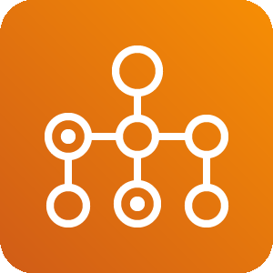 | `from resources.aws.compute import batch` |
|  | `from resources.aws.devtools import codestar` |
|  | `from resources.aws.devtools import x_ray` |
|  | `from resources.aws.devtools import command_line_interface` |
|  | `from resources.aws.devtools import tools_and_sdks` |
|  | `from resources.aws.devtools import codedeploy` |
|  | `from resources.aws.devtools import cloud9` |
|  | `from resources.aws.devtools import cloud_development_kit` |
|  | `from resources.aws.devtools import codepipeline` |
|  | `from resources.aws.devtools import codebuild` |
|  | `from resources.aws.devtools import developer_tools` |
|  | `from resources.aws.devtools import codecommit` |
|  | `from resources.aws.devtools import cloud9_resource` |
|  | `from resources.aws.integration import simple_queue_service_sqs_queue` |
| 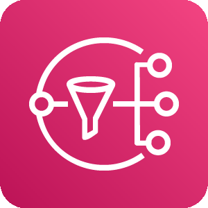 | `from resources.aws.integration import simple_notification_service_sns` |
|  | `from resources.aws.integration import simple_notification_service_sns_http_notification` |
|  | `from resources.aws.integration import application_integration` |
|  | `from resources.aws.integration import simple_notification_service_sns_topic` |
|  | `from resources.aws.integration import mq` |
|  | `from resources.aws.integration import express_workflows` |
|  | `from resources.aws.integration import step_functions` |
|  | `from resources.aws.integration import eventbridge` |
|  | `from resources.aws.integration import simple_queue_service_sqs_message` |
|  | `from resources.aws.integration import appsync` |
|  | `from resources.aws.integration import eventbridge_saas_partner_event_bus_resource` |
|  | `from resources.aws.integration import simple_notification_service_sns_email_notification` |
|  | `from resources.aws.integration import simple_queue_service_sqs` |
| 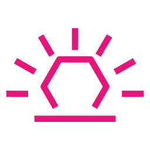 | `from resources.aws.integration import eventbridge_default_event_bus_resource` |
|  | `from resources.aws.integration import event_resource` |
|  | `from resources.aws.integration import console_mobile_application` |
|  | `from resources.aws.integration import eventbridge_custom_event_bus_resource` |
|  | `from resources.aws.enablement import support` |
|  | `from resources.aws.enablement import customer_enablement` |
|  | `from resources.aws.enablement import professional_services` |
|  | `from resources.aws.enablement import managed_services` |
|  | `from resources.aws.enablement import iq` |
|  | `from resources.aws.analytics import data_pipeline` |
|  | `from resources.aws.analytics import elasticsearch_service` |
|  | `from resources.aws.analytics import analytics` |
|  | `from resources.aws.analytics import kinesis` |
|  | `from resources.aws.analytics import lake_formation` |
|  | `from resources.aws.analytics import glue` |
|  | `from resources.aws.analytics import data_lake_resource` |
|  | `from resources.aws.analytics import emr_engine` |
|  | `from resources.aws.analytics import cloudsearch` |
|  | `from resources.aws.analytics import kinesis_data_firehose` |
|  | `from resources.aws.analytics import managed_streaming_for_kafka` |
|  | `from resources.aws.analytics import emr_engine_mapr_m3` |
|  | `from resources.aws.analytics import quicksight` |
|  | `from resources.aws.analytics import kinesis_data_analytics` |
|  | `from resources.aws.analytics import cloudsearch_search_documents` |
|  | `from resources.aws.analytics import emr_hdfs_cluster` |
|  | `from resources.aws.analytics import kinesis_video_streams` |
|  | `from resources.aws.analytics import athena` |
|  | `from resources.aws.analytics import redshift_dense_compute_node` |
|  | `from resources.aws.analytics import emr_engine_mapr_m5` |
|  | `from resources.aws.analytics import emr` |
|  | `from resources.aws.analytics import redshift_dense_storage_node` |
|  | `from resources.aws.analytics import kinesis_data_streams` |
|  | `from resources.aws.analytics import glue_crawlers` |
|  | `from resources.aws.analytics import emr_cluster` |
|  | `from resources.aws.analytics import emr_engine_mapr_m7` |
|  | `from resources.aws.analytics import glue_data_catalog` |
|  | `from resources.aws.analytics import redshift` |
|  | `from resources.aws.quantum import braket` |
|  | `from resources.aws.quantum import quantum_technologies` |
|  | `from resources.aws.storage import storage_gateway_virtual_tape_library` |
|  | `from resources.aws.storage import fsx_for_lustre` |
|  | `from resources.aws.storage import elastic_block_store_ebs_volume` |
|  | `from resources.aws.storage import elastic_block_store_ebs_snapshot` |
|  | `from resources.aws.storage import snowmobile` |
|  | `from resources.aws.storage import simple_storage_service_s3_bucket` |
|  | `from resources.aws.storage import storage_gateway` |
|  | `from resources.aws.storage import s3_glacier_vault` |
|  | `from resources.aws.storage import snowball` |
|  | `from resources.aws.storage import simple_storage_service_s3_object` |
|  | `from resources.aws.storage import backup` |
| 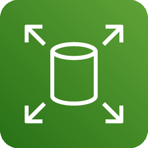 | `from resources.aws.storage import elastic_block_store_ebs` |
|  | `from resources.aws.storage import snowball_edge` |
|  | `from resources.aws.storage import s3_glacier` |
|  | `from resources.aws.storage import storage_gateway_non_cached_volume` |
|  | `from resources.aws.storage import cloudendure_disaster_recovery` |
|  | `from resources.aws.storage import storage_gateway_cached_volume` |
|  | `from resources.aws.storage import elastic_file_system_efs` |
|  | `from resources.aws.storage import efs_infrequentaccess_primary_bg` |
|  | `from resources.aws.storage import s3_glacier_archive` |
|  | `from resources.aws.storage import fsx` |
|  | `from resources.aws.storage import efs_standard_primary_bg` |
|  | `from resources.aws.storage import elastic_file_system_efs_file_system` |
|  | `from resources.aws.storage import multiple_volumes_resource` |
|  | `from resources.aws.storage import simple_storage_service_s3` |
|  | `from resources.aws.storage import storage` |
|  | `from resources.aws.storage import simple_storage_service_s3_bucket_with_objects` |
|  | `from resources.aws.storage import snow_family_snowball_import_export` |
|  | `from resources.aws.storage import fsx_for_windows_file_server` |
|  | `from resources.aws.general import user` |
|  | `from resources.aws.general import mobile_client` |
|  | `from resources.aws.general import internet_alt1` |
|  | `from resources.aws.general import saml_token` |
|  | `from resources.aws.general import multimedia` |
|  | `from resources.aws.general import disk` |
|  | `from resources.aws.general import general` |
|  | `from resources.aws.general import ssl_padlock` |
|  | `from resources.aws.general import client` |
|  | `from resources.aws.general import generic_sdk` |
|  | `from resources.aws.general import generic_saml_token` |
|  | `from resources.aws.general import toolkit` |
|  | `from resources.aws.general import internet_gateway` |
|  | `from resources.aws.general import generic_office_building` |
|  | `from resources.aws.general import tape_storage` |
|  | `from resources.aws.general import sdk` |
|  | `from resources.aws.general import traditional_server` |
|  | `from resources.aws.general import generic_firewall` |
|  | `from resources.aws.general import office_building` |
|  | `from resources.aws.general import marketplace` |
|  | `from resources.aws.general import users` |
|  | `from resources.aws.general import generic_database` |
|  | `from resources.aws.general import forums` |
|  | `from resources.aws.general import internet_alt2` |
|  | `from resources.aws.ml import personalize` |
|  | `from resources.aws.ml import rekognition` |
|  | `from resources.aws.ml import elastic_inference` |
|  | `from resources.aws.ml import sagemaker_model` |
|  | `from resources.aws.ml import rekognition_video` |
|  | `from resources.aws.ml import polly` |
|  | `from resources.aws.ml import kendra` |
|  | `from resources.aws.ml import rekognition_image` |
|  | `from resources.aws.ml import sagemaker_training_job` |
|  | `from resources.aws.ml import translate` |
|  | `from resources.aws.ml import comprehend` |
|  | `from resources.aws.ml import sagemaker` |
|  | `from resources.aws.ml import deepracer` |
|  | `from resources.aws.ml import augmented_ai` |
|  | `from resources.aws.ml import machine_learning` |
|  | `from resources.aws.ml import sagemaker_notebook` |
|  | `from resources.aws.ml import lex` |
|  | `from resources.aws.ml import apache_mxnet_on_aws` |
|  | `from resources.aws.ml import forecast` |
|  | `from resources.aws.ml import tensorflow_on_aws` |
|  | `from resources.aws.ml import deep_learning_containers` |
|  | `from resources.aws.ml import fraud_detector` |
|  | `from resources.aws.ml import textract` |
|  | `from resources.aws.ml import deeplens` |
|  | `from resources.aws.ml import deep_learning_amis` |
|  | `from resources.aws.ml import sagemaker_ground_truth` |
|  | `from resources.aws.ml import transcribe` |
|  | `from resources.aws.ml import deepcomposer` |
|  | `from resources.aws.enduser import appstream_2_0` |
|  | `from resources.aws.enduser import workspaces` |
|  | `from resources.aws.enduser import workdocs` |
|  | `from resources.aws.enduser import worklink` |
|  | `from resources.aws.enduser import desktop_and_app_streaming` |
|  | `from resources.aws.game import game_tech` |
|  | `from resources.aws.game import gamelift` |
|  | `from resources.aws.engagement import simple_email_service_ses` |
|  | `from resources.aws.engagement import pinpoint` |
|  | `from resources.aws.engagement import connect` |
|  | `from resources.aws.engagement import customer_engagement` |
|  | `from resources.aws.engagement import simple_email_service_ses_email` |
|  | `from resources.azure.iot import time_series_insights_environments` |
|  | `from resources.azure.iot import time_series_insights_events_sources` |
|  | `from resources.azure.iot import iot_central_applications` |
|  | `from resources.azure.iot import iot_hub_security` |
|  | `from resources.azure.iot import sphere` |
|  | `from resources.azure.iot import maps` |
|  | `from resources.azure.iot import device_provisioning_services` |
|  | `from resources.azure.iot import digital_twins` |
|  | `from resources.azure.iot import iot_hub` |
|  | `from resources.azure.iot import windows_10_iot_core_services` |
|  | `from resources.azure.migration import data_box_edge` |
|  | `from resources.azure.migration import data_box` |
|  | `from resources.azure.migration import database_migration_services` |
|  | `from resources.azure.migration import recovery_services_vaults` |
|  | `from resources.azure.migration import migration_projects` |
|  | `from resources.azure.mobile import notification_hubs` |
|  | `from resources.azure.mobile import app_service_mobile` |
|  | `from resources.azure.mobile import mobile_engagement` |
|  | `from resources.azure.devops import lab_services` |
|  | `from resources.azure.devops import repos` |
|  | `from resources.azure.devops import boards` |
|  | `from resources.azure.devops import pipelines` |
|  | `from resources.azure.devops import devtest_labs` |
|  | `from resources.azure.devops import test_plans` |
|  | `from resources.azure.devops import application_insights` |
|  | `from resources.azure.devops import artifacts` |
|  | `from resources.azure.devops import devops` |
|  | `from resources.azure.network import virtual_network_gateways` |
|  | `from resources.azure.network import virtual_wans` |
|  | `from resources.azure.network import front_doors` |
|  | `from resources.azure.network import expressroute_circuits` |
|  | `from resources.azure.network import ddos_protection_plans` |
|  | `from resources.azure.network import network_security_groups_classic` |
|  | `from resources.azure.network import connections` |
|  | `from resources.azure.network import application_gateway` |
|  | `from resources.azure.network import virtual_networks` |
|  | `from resources.azure.network import public_ip_addresses` |
|  | `from resources.azure.network import firewall` |
|  | `from resources.azure.network import cdn_profiles` |
|  | `from resources.azure.network import traffic_manager_profiles` |
|  | `from resources.azure.network import route_filters` |
|  | `from resources.azure.network import network_watcher` |
|  | `from resources.azure.network import service_endpoint_policies` |
|  | `from resources.azure.network import local_network_gateways` |
|  | `from resources.azure.network import route_tables` |
|  | `from resources.azure.network import dns_zones` |
|  | `from resources.azure.network import virtual_network_classic` |
|  | `from resources.azure.network import network_interfaces` |
|  | `from resources.azure.network import on_premises_data_gateways` |
|  | `from resources.azure.network import dns_private_zones` |
|  | `from resources.azure.network import reserved_ip_addresses_classic` |
|  | `from resources.azure.network import subnets` |
|  | `from resources.azure.network import load_balancers` |
|  | `from resources.azure.network import application_security_groups` |
|  | `from resources.azure.security import sentinel` |
|  | `from resources.azure.security import conditional_access` |
|  | `from resources.azure.security import key_vaults` |
|  | `from resources.azure.security import defender` |
|  | `from resources.azure.security import security_center` |
|  | `from resources.azure.security import application_security_groups` |
|  | `from resources.azure.security import extended_security_updates` |
|  | `from resources.azure.database import sql_vm` |
|  | `from resources.azure.database import synapse_analytics` |
|  | `from resources.azure.database import data_explorer_clusters` |
|  | `from resources.azure.database import elastic_job_agents` |
|  | `from resources.azure.database import sql_servers` |
|  | `from resources.azure.database import data_factory` |
|  | `from resources.azure.database import data_lake` |
|  | `from resources.azure.database import sql_databases` |
|  | `from resources.azure.database import database_for_mysql_servers` |
|  | `from resources.azure.database import virtual_clusters` |
|  | `from resources.azure.database import sql_managed_instances` |
|  | `from resources.azure.database import database_for_mariadb_servers` |
|  | `from resources.azure.database import managed_databases` |
|  | `from resources.azure.database import virtual_datacenter` |
|  | `from resources.azure.database import cache_for_redis` |
|  | `from resources.azure.database import ssis_lift_and_shift_ir` |
|  | `from resources.azure.database import sql_server_stretch_databases` |
|  | `from resources.azure.database import blob_storage` |
|  | `from resources.azure.database import sql` |
|  | `from resources.azure.database import database_for_postgresql_servers` |
|  | `from resources.azure.database import sql_datawarehouse` |
|  | `from resources.azure.database import instance_pools` |
|  | `from resources.azure.database import cosmos_db` |
|  | `from resources.azure.database import elastic_database_pools` |
|  | `from resources.azure.web import app_service_environments` |
|  | `from resources.azure.web import signalr` |
|  | `from resources.azure.web import search` |
|  | `from resources.azure.web import media_services` |
|  | `from resources.azure.web import app_service_plans` |
|  | `from resources.azure.web import notification_hub_namespaces` |
|  | `from resources.azure.web import app_service_domains` |
|  | `from resources.azure.web import app_service_certificates` |
|  | `from resources.azure.web import api_connections` |
|  | `from resources.azure.web import app_services` |
|  | `from resources.azure.compute import image_versions` |
|  | `from resources.azure.compute import sap_hana_on_azure` |
| 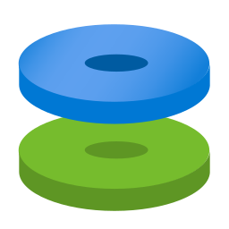 | `from resources.azure.compute import disks` |
|  | `from resources.azure.compute import citrix_virtual_desktops_essentials` |
|  | `from resources.azure.compute import vm_linux` |
| 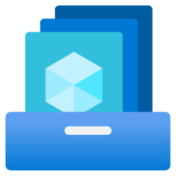 | `from resources.azure.compute import shared_image_galleries` |
|  | `from resources.azure.compute import mesh_applications` |
|  | `from resources.azure.compute import workspaces` |
|  | `from resources.azure.compute import cloud_services_classic` |
|  | `from resources.azure.compute import function_apps` |
|  | `from resources.azure.compute import os_images` |
|  | `from resources.azure.compute import spring_cloud` |
|  | `from resources.azure.compute import batch_accounts` |
|  | `from resources.azure.compute import service_fabric_clusters` |
|  | `from resources.azure.compute import cloudsimple_virtual_machines` |
|  | `from resources.azure.compute import disk_snapshots` |
|  | `from resources.azure.compute import vm_scale_set` |
|  | `from resources.azure.compute import vm` |
|  | `from resources.azure.compute import vm_windows` |
|  | `from resources.azure.compute import availability_sets` |
|  | `from resources.azure.compute import disk_encryption_sets` |
|  | `from resources.azure.compute import cloud_services` |
|  | `from resources.azure.compute import automanaged_vm` |
|  | `from resources.azure.compute import image_definitions` |
| 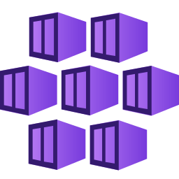 | `from resources.azure.compute import kubernetes_services` |
|  | `from resources.azure.compute import container_instances` |
|  | `from resources.azure.compute import app_services` |
|  | `from resources.azure.compute import vm_classic` |
|  | `from resources.azure.compute import container_registries` |
|  | `from resources.azure.compute import vm_images` |
|  | `from resources.azure.integration import api_for_fhir` |
|  | `from resources.azure.integration import software_as_a_service` |
|  | `from resources.azure.integration import integration_accounts` |
|  | `from resources.azure.integration import service_bus_relays` |
|  | `from resources.azure.integration import sendgrid_accounts` |
|  | `from resources.azure.integration import service_catalog_managed_application_definitions` |
|  | `from resources.azure.integration import api_management` |
|  | `from resources.azure.integration import app_configuration` |
|  | `from resources.azure.integration import event_grid_domains` |
|  | `from resources.azure.integration import integration_service_environments` |
|  | `from resources.azure.integration import system_topic` |
|  | `from resources.azure.integration import partner_topic` |
|  | `from resources.azure.integration import data_catalog` |
|  | `from resources.azure.integration import storsimple_device_managers` |
|  | `from resources.azure.integration import logic_apps` |
|  | `from resources.azure.integration import service_bus` |
|  | `from resources.azure.integration import event_grid_topics` |
|  | `from resources.azure.integration import logic_apps_custom_connector` |
|  | `from resources.azure.integration import event_grid_subscriptions` |
|  | `from resources.azure.analytics import event_hubs` |
|  | `from resources.azure.analytics import synapse_analytics` |
|  | `from resources.azure.analytics import data_explorer_clusters` |
|  | `from resources.azure.analytics import data_lake_analytics` |
|  | `from resources.azure.analytics import analysis_services` |
|  | `from resources.azure.analytics import log_analytics_workspaces` |
|  | `from resources.azure.analytics import hdinsightclusters` |
|  | `from resources.azure.analytics import data_lake_store_gen1` |
|  | `from resources.azure.analytics import databricks` |
| 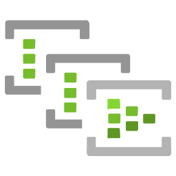 | `from resources.azure.analytics import event_hub_clusters` |
|  | `from resources.azure.analytics import data_factories` |
|  | `from resources.azure.analytics import stream_analytics_jobs` |
|  | `from resources.azure.storage import storage_accounts` |
|  | `from resources.azure.storage import storsimple_data_managers` |
|  | `from resources.azure.storage import storage_accounts_classic` |
|  | `from resources.azure.storage import storage_sync_services` |
|  | `from resources.azure.storage import data_box` |
|  | `from resources.azure.storage import queues_storage` |
|  | `from resources.azure.storage import data_lake_storage` |
|  | `from resources.azure.storage import azurefxtedgefiler` |
| 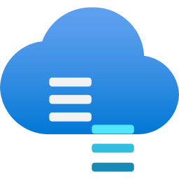 | `from resources.azure.storage import storsimple_device_managers` |
|  | `from resources.azure.storage import blob_storage` |
|  | `from resources.azure.storage import archive_storage` |
|  | `from resources.azure.storage import general_storage` |
|  | `from resources.azure.storage import storage_explorer` |
|  | `from resources.azure.storage import table_storage` |
|  | `from resources.azure.storage import data_box_edge_data_box_gateway` |
|  | `from resources.azure.storage import netapp_files` |
|  | `from resources.azure.general import supportrequests` |
| 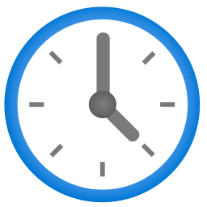 | `from resources.azure.general import recent` |
|  | `from resources.azure.general import usericon` |
|  | `from resources.azure.general import support` |
|  | `from resources.azure.general import developertools` |
|  | `from resources.azure.general import tags` |
|  | `from resources.azure.general import azurehome` |
|  | `from resources.azure.general import userprivacy` |
|  | `from resources.azure.general import shareddashboard` |
|  | `from resources.azure.general import resourcegroups` |
|  | `from resources.azure.general import templates` |
|  | `from resources.azure.general import userresource` |
|  | `from resources.azure.general import reservations` |
|  | `from resources.azure.general import twousericon` |
|  | `from resources.azure.general import information` |
|  | `from resources.azure.general import resource` |
|  | `from resources.azure.general import helpsupport` |
|  | `from resources.azure.general import quickstartcenter` |
|  | `from resources.azure.general import subscriptions` |
|  | `from resources.azure.general import marketplace` |
|  | `from resources.azure.general import allresources` |
|  | `from resources.azure.general import whatsnew` |
|  | `from resources.azure.general import tag` |
|  | `from resources.azure.general import userhealthicon` |
|  | `from resources.azure.general import servicehealth` |
|  | `from resources.azure.general import managementgroups` |
|  | `from resources.azure.identity import app_registrations` |
|  | `from resources.azure.identity import ad_privileged_identity_management` |
|  | `from resources.azure.identity import ad_b2c` |
|  | `from resources.azure.identity import conditional_access` |
|  | `from resources.azure.identity import groups` |
| 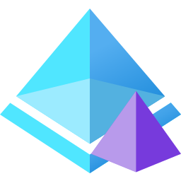 | `from resources.azure.identity import ad_domain_services` |
|  | `from resources.azure.identity import identity_governance` |
|  | `from resources.azure.identity import managed_identities` |
|  | `from resources.azure.identity import information_protection` |
|  | `from resources.azure.identity import access_review` |
|  | `from resources.azure.identity import ad_identity_protection` |
|  | `from resources.azure.identity import active_directory_connect_health` |
| 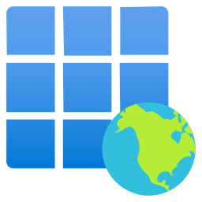 | `from resources.azure.identity import enterprise_applications` |
| 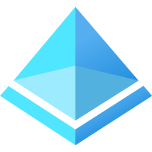 | `from resources.azure.identity import active_directory` |
|  | `from resources.azure.identity import users` |
|  | `from resources.azure.ml import bot_services` |
|  | `from resources.azure.ml import machine_learning_studio_web_services` |
|  | `from resources.azure.ml import machine_learning_studio_workspaces` |
|  | `from resources.azure.ml import machine_learning_studio_web_service_plans` |
|  | `from resources.azure.ml import cognitive_services` |
|  | `from resources.azure.ml import batch_ai` |
|  | `from resources.azure.ml import genomics_accounts` |
|  | `from resources.azure.ml import machine_learning_service_workspaces` |
|  | `from resources.saas.alerting import opsgenie` |
|  | `from resources.saas.alerting import newrelic` |
|  | `from resources.saas.alerting import pushover` |
|  | `from resources.saas.filesharing import nextcloud` |
|  | `from resources.saas.media import cloudinary` |
|  | `from resources.saas.logging import papertrail` |
|  | `from resources.saas.logging import newrelic` |
|  | `from resources.saas.logging import datadog` |
|  | `from resources.saas.cdn import cloudflare` |
|  | `from resources.saas.cdn import akamai` |
|  | `from resources.saas.analytics import stitch` |
|  | `from resources.saas.analytics import snowflake` |
|  | `from resources.saas.social import twitter` |
|  | `from resources.saas.social import facebook` |
|  | `from resources.saas.identity import okta` |
|  | `from resources.saas.identity import auth0` |
|  | `from resources.saas.recommendation import recombee` |
|  | `from resources.saas.chat import slack` |
|  | `from resources.saas.chat import discord` |
|  | `from resources.saas.chat import mattermost` |
|  | `from resources.saas.chat import rocket_chat` |
|  | `from resources.saas.chat import telegram` |
|  | `from resources.saas.chat import teams` |
|  | `from resources.generic.device import tablet` |
|  | `from resources.generic.device import mobile` |
|  | `from resources.generic.place import datacenter` |
|  | `from resources.generic.network import subnet` |
|  | `from resources.generic.network import router` |
|  | `from resources.generic.network import firewall` |
|  | `from resources.generic.network import vpn` |
|  | `from resources.generic.network import switch` |
|  | `from resources.generic.database import sql` |
|  | `from resources.generic.os import ubuntu` |
|  | `from resources.generic.os import suse` |
|  | `from resources.generic.os import centos` |
|  | `from resources.generic.os import android` |
|  | `from resources.generic.os import ios` |
|  | `from resources.generic.os import windows` |
|  | `from resources.generic.os import linux_general` |
|  | `from resources.generic.virtualization import xen` |
|  | `from resources.generic.virtualization import virtualbox` |
|  | `from resources.generic.virtualization import vmware` |
|  | `from resources.generic.compute import rack` |
|  | `from resources.generic.blank import blank` |
|  | `from resources.generic.storage import storage` |
|  | `from resources.alibabacloud.iot import iot_internet_device_id` |
|  | `from resources.alibabacloud.iot import iot_link_wan` |
|  | `from resources.alibabacloud.iot import iot_mobile_connection_package` |
|  | `from resources.alibabacloud.iot import iot_platform` |
|  | `from resources.alibabacloud.network import virtual_private_cloud` |
|  | `from resources.alibabacloud.network import server_load_balancer` |
|  | `from resources.alibabacloud.network import smart_access_gateway` |
|  | `from resources.alibabacloud.network import express_connect` |
|  | `from resources.alibabacloud.network import cdn` |
|  | `from resources.alibabacloud.network import cloud_enterprise_network` |
|  | `from resources.alibabacloud.network import vpn_gateway` |
|  | `from resources.alibabacloud.network import elastic_ip_address` |
|  | `from resources.alibabacloud.network import nat_gateway` |
|  | `from resources.alibabacloud.security import crowdsourced_security_testing` |
|  | `from resources.alibabacloud.security import ssl_certificates` |
|  | `from resources.alibabacloud.security import id_verification` |
|  | `from resources.alibabacloud.security import data_encryption_service` |
|  | `from resources.alibabacloud.security import web_application_firewall` |
|  | `from resources.alibabacloud.security import managed_security_service` |
|  | `from resources.alibabacloud.security import anti_ddos_pro` |
|  | `from resources.alibabacloud.security import anti_ddos_basic` |
|  | `from resources.alibabacloud.security import antifraud_service` |
|  | `from resources.alibabacloud.security import anti_bot_service` |
|  | `from resources.alibabacloud.security import bastion_host` |
|  | `from resources.alibabacloud.security import db_audit` |
|  | `from resources.alibabacloud.security import cloud_firewall` |
|  | `from resources.alibabacloud.security import cloud_security_scanner` |
|  | `from resources.alibabacloud.security import security_center` |
|  | `from resources.alibabacloud.security import game_shield` |
|  | `from resources.alibabacloud.security import content_moderation` |
|  | `from resources.alibabacloud.security import server_guard` |
|  | `from resources.alibabacloud.database import apsaradb_ppas` |
|  | `from resources.alibabacloud.database import data_transmission_service` |
|  | `from resources.alibabacloud.database import data_management_service` |
|  | `from resources.alibabacloud.database import disribute_relational_database_service` |
|  | `from resources.alibabacloud.database import apsaradb_postgresql` |
|  | `from resources.alibabacloud.database import hybriddb_for_mysql` |
|  | `from resources.alibabacloud.database import apsaradb_cassandra` |
|  | `from resources.alibabacloud.database import relational_database_service` |
|  | `from resources.alibabacloud.database import database_backup_service` |
|  | `from resources.alibabacloud.database import graph_database_service` |
|  | `from resources.alibabacloud.database import apsaradb_hbase` |
|  | `from resources.alibabacloud.database import apsaradb_oceanbase` |
|  | `from resources.alibabacloud.database import apsaradb_polardb` |
|  | `from resources.alibabacloud.database import apsaradb_mongodb` |
|  | `from resources.alibabacloud.database import apsaradb_redis` |
|  | `from resources.alibabacloud.database import apsaradb_memcache` |
|  | `from resources.alibabacloud.database import apsaradb_sqlserver` |
|  | `from resources.alibabacloud.web import dns` |
|  | `from resources.alibabacloud.web import domain` |
|  | `from resources.alibabacloud.compute import resource_orchestration_service` |
|  | `from resources.alibabacloud.compute import server_load_balancer` |
|  | `from resources.alibabacloud.compute import container_service` |
|  | `from resources.alibabacloud.compute import web_app_service` |
|  | `from resources.alibabacloud.compute import elastic_search` |
|  | `from resources.alibabacloud.compute import serverless_app_engine` |
|  | `from resources.alibabacloud.compute import batch_compute` |
|  | `from resources.alibabacloud.compute import container_registry` |
|  | `from resources.alibabacloud.compute import simple_application_server` |
|  | `from resources.alibabacloud.compute import operation_orchestration_service` |
|  | `from resources.alibabacloud.compute import elastic_container_instance` |
|  | `from resources.alibabacloud.compute import elastic_compute_service` |
|  | `from resources.alibabacloud.compute import function_compute` |
|  | `from resources.alibabacloud.compute import elastic_high_performance_computing` |
|  | `from resources.alibabacloud.compute import auto_scaling` |
|  | `from resources.alibabacloud.application import blockchain_as_a_service` |
|  | `from resources.alibabacloud.application import direct_mail` |
|  | `from resources.alibabacloud.application import bee_bot` |
|  | `from resources.alibabacloud.application import cloud_call_center` |
|  | `from resources.alibabacloud.application import open_search` |
|  | `from resources.alibabacloud.application import api_gateway` |
|  | `from resources.alibabacloud.application import yida` |
|  | `from resources.alibabacloud.application import performance_testing_service` |
|  | `from resources.alibabacloud.application import log_service` |
|  | `from resources.alibabacloud.application import message_notification_service` |
|  | `from resources.alibabacloud.application import rd_cloud` |
|  | `from resources.alibabacloud.application import code_pipeline` |
|  | `from resources.alibabacloud.application import smart_conversation_analysis` |
|  | `from resources.alibabacloud.application import node_js_performance_platform` |
|  | `from resources.alibabacloud.analytics import data_lake_analytics` |
|  | `from resources.alibabacloud.analytics import click_house` |
|  | `from resources.alibabacloud.analytics import open_search` |
|  | `from resources.alibabacloud.analytics import analytic_db` |
|  | `from resources.alibabacloud.analytics import elatic_map_reduce` |
|  | `from resources.alibabacloud.storage import object_table_store` |
|  | `from resources.alibabacloud.storage import hybrid_cloud_disaster_recovery` |
|  | `from resources.alibabacloud.storage import file_storage_nas` |
|  | `from resources.alibabacloud.storage import file_storage_hdfs` |
|  | `from resources.alibabacloud.storage import cloud_storage_gateway` |
|  | `from resources.alibabacloud.storage import hybrid_backup_recovery` |
|  | `from resources.alibabacloud.storage import imm` |
|  | `from resources.alibabacloud.storage import object_storage_service` |
|  | `from resources.alibabacloud.communication import mobile_push` |
|  | `from resources.alibabacloud.communication import direct_mail` |
|  | `from resources.programming.flowchart import collate` |
|  | `from resources.programming.flowchart import database` |
|  | `from resources.programming.flowchart import off_page_connector_left` |
|  | `from resources.programming.flowchart import predefined_process` |
|  | `from resources.programming.flowchart import manual_input` |
|  | `from resources.programming.flowchart import off_page_connector_right` |
|  | `from resources.programming.flowchart import start_end` |
|  | `from resources.programming.flowchart import delay` |
|  | `from resources.programming.flowchart import input_output` |
|  | `from resources.programming.flowchart import loop_limit` |
|  | `from resources.programming.flowchart import decision` |
|  | `from resources.programming.flowchart import multiple_documents` |
|  | `from resources.programming.flowchart import stored_data` |
|  | `from resources.programming.flowchart import inspection` |
|  | `from resources.programming.flowchart import internal_storage` |
|  | `from resources.programming.flowchart import merge` |
|  | `from resources.programming.flowchart import sort` |
|  | `from resources.programming.flowchart import action` |
|  | `from resources.programming.flowchart import or` |
|  | `from resources.programming.flowchart import document` |
|  | `from resources.programming.flowchart import display` |
|  | `from resources.programming.flowchart import preparation` |
|  | `from resources.programming.flowchart import summing_junction` |
|  | `from resources.programming.flowchart import manual_loop` |
|  | `from resources.programming.framework import vue` |
|  | `from resources.programming.framework import laravel` |
|  | `from resources.programming.framework import react` |
|  | `from resources.programming.framework import spring` |
|  | `from resources.programming.framework import fastapi` |
|  | `from resources.programming.framework import rails` |
|  | `from resources.programming.framework import backbone` |
|  | `from resources.programming.framework import flask` |
|  | `from resources.programming.framework import micronaut` |
|  | `from resources.programming.framework import angular` |
|  | `from resources.programming.framework import flutter` |
|  | `from resources.programming.framework import starlette` |
|  | `from resources.programming.framework import django` |
|  | `from resources.programming.framework import graphql` |
|  | `from resources.programming.framework import ember` |
|  | `from resources.programming.language import latex` |
|  | `from resources.programming.language import nodejs` |
|  | `from resources.programming.language import matlab` |
|  | `from resources.programming.language import scala` |
|  | `from resources.programming.language import r` |
|  | `from resources.programming.language import java` |
|  | `from resources.programming.language import python` |
|  | `from resources.programming.language import elixir` |
|  | `from resources.programming.language import cpp` |
|  | `from resources.programming.language import php` |
|  | `from resources.programming.language import c` |
|  | `from resources.programming.language import csharp` |
|  | `from resources.programming.language import bash` |
|  | `from resources.programming.language import kotlin` |
|  | `from resources.programming.language import javascript` |
|  | `from resources.programming.language import erlang` |
|  | `from resources.programming.language import rust` |
|  | `from resources.programming.language import dart` |
|  | `from resources.programming.language import swift` |
|  | `from resources.programming.language import ruby` |
|  | `from resources.programming.language import typescript` |
| 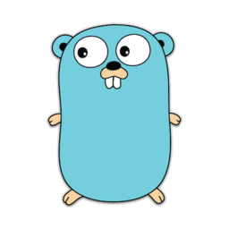 | `from resources.programming.language import go` |
|  | `from resources.programming.runtime import dapr` |
|  | `from resources.openstack import openstack` |
|  | `from resources.openstack.applicationlifecycle import murano` |
|  | `from resources.openstack.applicationlifecycle import freezer` |
|  | `from resources.openstack.applicationlifecycle import masakari` |
|  | `from resources.openstack.applicationlifecycle import solum` |
| 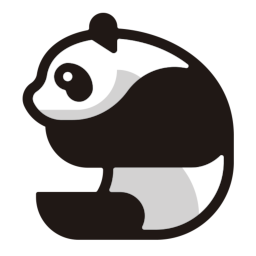 | `from resources.openstack.multiregion import tricircle` |
|  | `from resources.openstack.sharedservices import searchlight` |
|  | `from resources.openstack.sharedservices import keystone` |
|  | `from resources.openstack.sharedservices import karbor` |
|  | `from resources.openstack.sharedservices import barbican` |
|  | `from resources.openstack.sharedservices import glance` |
|  | `from resources.openstack.apiproxies import ec2api` |
|  | `from resources.openstack.user import openstackclient` |
|  | `from resources.openstack.baremetal import cyborg` |
|  | `from resources.openstack.baremetal import ironic` |
|  | `from resources.openstack.monitoring import telemetry` |
|  | `from resources.openstack.monitoring import monasca` |
| 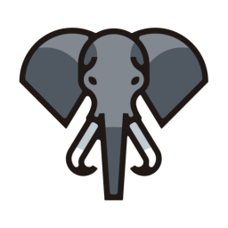 | `from resources.openstack.workloadprovisioning import sahara` |
|  | `from resources.openstack.workloadprovisioning import magnum` |
|  | `from resources.openstack.workloadprovisioning import trove` |
|  | `from resources.openstack.compute import qinling` |
|  | `from resources.openstack.compute import nova` |
|  | `from resources.openstack.compute import zun` |
|  | `from resources.openstack.orchestration import zaqar` |
|  | `from resources.openstack.orchestration import mistral` |
|  | `from resources.openstack.orchestration import heat` |
|  | `from resources.openstack.orchestration import blazar` |
|  | `from resources.openstack.orchestration import senlin` |
|  | `from resources.openstack.deployment import kolla` |
|  | `from resources.openstack.deployment import charms` |
|  | `from resources.openstack.deployment import helm` |
|  | `from resources.openstack.deployment import ansible` |
|  | `from resources.openstack.deployment import tripleo` |
|  | `from resources.openstack.deployment import chef` |
|  | `from resources.openstack.storage import cinder` |
|  | `from resources.openstack.storage import manila` |
|  | `from resources.openstack.storage import swift` |
|  | `from resources.openstack.frontend import horizon` |
|  | `from resources.openstack.nfv import tacker` |
|  | `from resources.openstack.billing import cloudkitty` |
|  | `from resources.openstack.optimization import watcher` |
|  | `from resources.openstack.optimization import rally` |
|  | `from resources.openstack.optimization import vitrage` |
|  | `from resources.openstack.optimization import congress` |
|  | `from resources.openstack.networking import octavia` |
|  | `from resources.openstack.networking import neutron` |
|  | `from resources.openstack.networking import designate` |
|  | `from resources.openstack.containerservices import kuryr` |
|  | `from resources.openstack.packaging import puppet` |
|  | `from resources.openstack.packaging import loci` |
|  | `from resources.openstack.packaging import rpm` |
|  | `from resources.k8s.group import ns` |
|  | `from resources.k8s.others import psp` |
|  | `from resources.k8s.others import crd` |
|  | `from resources.k8s.network import ing` |
|  | `from resources.k8s.network import netpol` |
|  | `from resources.k8s.network import ep` |
|  | `from resources.k8s.network import svc` |
|  | `from resources.k8s.clusterconfig import quota` |
|  | `from resources.k8s.clusterconfig import hpa` |
|  | `from resources.k8s.clusterconfig import limits` |
|  | `from resources.k8s.podconfig import cm` |
|  | `from resources.k8s.podconfig import secret` |
|  | `from resources.k8s.compute import cronjob` |
|  | `from resources.k8s.compute import job` |
|  | `from resources.k8s.compute import rs` |
|  | `from resources.k8s.compute import sts` |
|  | `from resources.k8s.compute import pod` |
|  | `from resources.k8s.compute import ds` |
|  | `from resources.k8s.compute import deploy` |
|  | `from resources.k8s.storage import sc` |
|  | `from resources.k8s.storage import pv` |
|  | `from resources.k8s.storage import pvc` |
|  | `from resources.k8s.storage import vol` |
|  | `from resources.k8s.infra import etcd` |
|  | `from resources.k8s.infra import node` |
|  | `from resources.k8s.infra import master` |
|  | `from resources.k8s.rbac import user` |
|  | `from resources.k8s.rbac import sa` |
|  | `from resources.k8s.rbac import rb` |
|  | `from resources.k8s.rbac import c_role` |
|  | `from resources.k8s.rbac import crb` |
|  | `from resources.k8s.rbac import role` |
|  | `from resources.k8s.rbac import group` |
|  | `from resources.k8s.ecosystem import external_dns` |
|  | `from resources.k8s.ecosystem import kustomize` |
|  | `from resources.k8s.ecosystem import krew` |
|  | `from resources.k8s.ecosystem import helm` |
|  | `from resources.k8s.chaos import chaos_mesh` |
|  | `from resources.k8s.chaos import litmus_chaos` |
|  | `from resources.k8s.controlplane import kubelet` |
|  | `from resources.k8s.controlplane import c_c_m` |
|  | `from resources.k8s.controlplane import c_m` |
|  | `from resources.k8s.controlplane import k_proxy` |
|  | `from resources.k8s.controlplane import sched` |
|  | `from resources.k8s.controlplane import api` |
|  | `from resources.onprem.queue import nats` |
|  | `from resources.onprem.queue import rabbitmq` |
|  | `from resources.onprem.queue import kafka` |
| 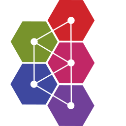 | `from resources.onprem.queue import activemq` |
|  | `from resources.onprem.queue import celery` |
|  | `from resources.onprem.queue import zeromq` |
|  | `from resources.onprem.mlops import polyaxon` |
|  | `from resources.onprem.iac import atlantis` |
|  | `from resources.onprem.iac import puppet` |
|  | `from resources.onprem.iac import terraform` |
|  | `from resources.onprem.iac import ansible` |
|  | `from resources.onprem.iac import awx` |
|  | `from resources.onprem.inmemory import memcached` |
|  | `from resources.onprem.inmemory import redis` |
|  | `from resources.onprem.inmemory import hazelcast` |
|  | `from resources.onprem.inmemory import aerospike` |
|  | `from resources.onprem.aggregator import vector` |
|  | `from resources.onprem.aggregator import fluentd` |
|  | `from resources.onprem.vcs import gitea` |
|  | `from resources.onprem.vcs import svn` |
|  | `from resources.onprem.vcs import gitlab` |
|  | `from resources.onprem.vcs import git` |
|  | `from resources.onprem.vcs import github` |
|  | `from resources.onprem.network import pfsense` |
|  | `from resources.onprem.network import internet` |
|  | `from resources.onprem.network import haproxy` |
|  | `from resources.onprem.network import kong` |
|  | `from resources.onprem.network import opnsense` |
|  | `from resources.onprem.network import etcd` |
|  | `from resources.onprem.network import tyk` |
|  | `from resources.onprem.network import vyos` |
|  | `from resources.onprem.network import powerdns` |
|  | `from resources.onprem.network import jbossas` |
|  | `from resources.onprem.network import glassfish` |
|  | `from resources.onprem.network import traefik` |
|  | `from resources.onprem.network import ambassador` |
|  | `from resources.onprem.network import gunicorn` |
|  | `from resources.onprem.network import jetty` |
|  | `from resources.onprem.network import pomerium` |
|  | `from resources.onprem.network import wildfly` |
|  | `from resources.onprem.network import consul` |
|  | `from resources.onprem.network import nginx` |
|  | `from resources.onprem.network import apache` |
|  | `from resources.onprem.network import tomcat` |
|  | `from resources.onprem.network import open_service_mesh` |
|  | `from resources.onprem.network import bind_9` |
|  | `from resources.onprem.network import caddy` |
|  | `from resources.onprem.network import ocelot` |
|  | `from resources.onprem.network import linkerd` |
|  | `from resources.onprem.network import istio` |
|  | `from resources.onprem.network import envoy` |
|  | `from resources.onprem.network import zookeeper` |
|  | `from resources.onprem.security import vault` |
|  | `from resources.onprem.security import trivy` |
|  | `from resources.onprem.security import bitwarden` |
|  | `from resources.onprem.dns import coredns` |
|  | `from resources.onprem.dns import powerdns` |
|  | `from resources.onprem.database import scylla` |
|  | `from resources.onprem.database import janusgraph` |
|  | `from resources.onprem.database import druid` |
|  | `from resources.onprem.database import dgraph` |
|  | `from resources.onprem.database import mysql` |
|  | `from resources.onprem.database import clickhouse` |
|  | `from resources.onprem.database import neo4j` |
|  | `from resources.onprem.database import couchdb` |
|  | `from resources.onprem.database import influxdb` |
|  | `from resources.onprem.database import postgresql` |
|  | `from resources.onprem.database import cassandra` |
|  | `from resources.onprem.database import oracle` |
|  | `from resources.onprem.database import cockroachdb` |
|  | `from resources.onprem.database import couchbase` |
|  | `from resources.onprem.database import mssql` |
|  | `from resources.onprem.database import mariadb` |
|  | `from resources.onprem.database import mongodb` |
|  | `from resources.onprem.database import hbase` |
|  | `from resources.onprem.search import solr` |
|  | `from resources.onprem.workflow import nifi` |
|  | `from resources.onprem.workflow import kubeflow` |
|  | `from resources.onprem.workflow import airflow` |
|  | `from resources.onprem.workflow import digdag` |
|  | `from resources.onprem.monitoring import humio` |
|  | `from resources.onprem.monitoring import grafana` |
|  | `from resources.onprem.monitoring import prometheus_operator` |
|  | `from resources.onprem.monitoring import splunk` |
|  | `from resources.onprem.monitoring import prometheus` |
|  | `from resources.onprem.monitoring import sentry` |
|  | `from resources.onprem.monitoring import cortex` |
|  | `from resources.onprem.monitoring import newrelic` |
|  | `from resources.onprem.monitoring import dynatrace` |
|  | `from resources.onprem.monitoring import nagios` |
|  | `from resources.onprem.monitoring import thanos` |
|  | `from resources.onprem.monitoring import zabbix` |
|  | `from resources.onprem.monitoring import datadog` |
|  | `from resources.onprem.container import k3s` |
|  | `from resources.onprem.container import crio` |
|  | `from resources.onprem.container import containerd` |
|  | `from resources.onprem.container import rkt` |
| 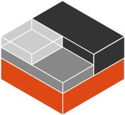 | `from resources.onprem.container import lxc` |
|  | `from resources.onprem.container import gvisor` |
| 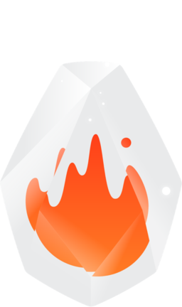 | `from resources.onprem.container import firecracker` |
|  | `from resources.onprem.container import docker` |
|  | `from resources.onprem.gitops import flagger` |
|  | `from resources.onprem.gitops import flux` |
|  | `from resources.onprem.gitops import argocd` |
|  | `from resources.onprem.logging import syslog_ng` |
|  | `from resources.onprem.logging import rsyslog` |
|  | `from resources.onprem.logging import graylog` |
|  | `from resources.onprem.logging import loki` |
|  | `from resources.onprem.logging import fluentbit` |
|  | `from resources.onprem.compute import nomad` |
|  | `from resources.onprem.compute import server` |
|  | `from resources.onprem.etl import embulk` |
|  | `from resources.onprem.tracing import jaeger` |
|  | `from resources.onprem.certificates import lets_encrypt` |
|  | `from resources.onprem.certificates import cert_manager` |
|  | `from resources.onprem.proxmox import pve` |
|  | `from resources.onprem.auth import buzzfeed_sso` |
|  | `from resources.onprem.auth import oauth2_proxy` |
|  | `from resources.onprem.auth import boundary` |
|  | `from resources.onprem.analytics import norikra` |
|  | `from resources.onprem.analytics import storm` |
|  | `from resources.onprem.analytics import beam` |
|  | `from resources.onprem.analytics import metabase` |
|  | `from resources.onprem.analytics import spark` |
|  | `from resources.onprem.analytics import singer` |
|  | `from resources.onprem.analytics import presto` |
|  | `from resources.onprem.analytics import tableau` |
|  | `from resources.onprem.analytics import powerbi` |
|  | `from resources.onprem.analytics import databricks` |
|  | `from resources.onprem.analytics import superset` |
|  | `from resources.onprem.analytics import hadoop` |
| 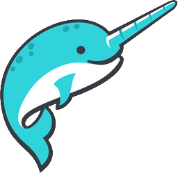 | `from resources.onprem.analytics import dremio` |
|  | `from resources.onprem.analytics import dbt` |
|  | `from resources.onprem.analytics import flink` |
|  | `from resources.onprem.analytics import hive` |
|  | `from resources.onprem.storage import ceph_osd` |
|  | `from resources.onprem.storage import ceph` |
|  | `from resources.onprem.storage import glusterfs` |
|  | `from resources.onprem.identity import dex` |
|  | `from resources.onprem.groupware import nextcloud` |
|  | `from resources.onprem.ci import travisci` |
|  | `from resources.onprem.ci import concourseci` |
|  | `from resources.onprem.ci import zuulci` |
|  | `from resources.onprem.ci import circleci` |
|  | `from resources.onprem.ci import jenkins` |
|  | `from resources.onprem.ci import gitlabci` |
|  | `from resources.onprem.ci import teamcity` |
|  | `from resources.onprem.ci import droneci` |
|  | `from resources.onprem.ci import github_actions` |
|  | `from resources.onprem.cd import tekton` |
|  | `from resources.onprem.cd import tekton_cli` |
|  | `from resources.onprem.cd import spinnaker` |
|  | `from resources.onprem.client import user` |
|  | `from resources.onprem.client import client` |
|  | `from resources.onprem.client import users` |
|  | `from resources.digitalocean.network import firewall` |
|  | `from resources.digitalocean.network import floating_ip` |
|  | `from resources.digitalocean.network import vpc` |
|  | `from resources.digitalocean.network import internet_gateway` |
|  | `from resources.digitalocean.network import domain` |
|  | `from resources.digitalocean.network import load_balancer` |
|  | `from resources.digitalocean.network import domain_registration` |
|  | `from resources.digitalocean.network import managed_vpn` |
|  | `from resources.digitalocean.network import certificate` |
|  | `from resources.digitalocean.database import dbaas_primary` |
|  | `from resources.digitalocean.database import dbaas_read_only` |
|  | `from resources.digitalocean.database import dbaas_primary_standby_more` |
|  | `from resources.digitalocean.database import dbaas_standby` |
|  | `from resources.digitalocean.compute import k8s_node` |
|  | `from resources.digitalocean.compute import containers` |
|  | `from resources.digitalocean.compute import droplet_snapshot` |
| 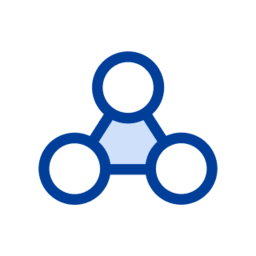 | `from resources.digitalocean.compute import k8s_node_pool` |
|  | `from resources.digitalocean.compute import droplet` |
|  | `from resources.digitalocean.compute import k8s_cluster` |
|  | `from resources.digitalocean.compute import droplet_connect` |
|  | `from resources.digitalocean.compute import docker` |
|  | `from resources.digitalocean.storage import volume` |
|  | `from resources.digitalocean.storage import volume_snapshot` |
|  | `from resources.digitalocean.storage import space` |
|  | `from resources.digitalocean.storage import folder` |
|  | `from resources.firebase.extentions import extensions` |
|  | `from resources.firebase.grow import in_app_messaging` |
|  | `from resources.firebase.grow import app_indexing` |
|  | `from resources.firebase.grow import remote_config` |
|  | `from resources.firebase.grow import ab_testing` |
|  | `from resources.firebase.grow import dynamic_links` |
|  | `from resources.firebase.grow import invites` |
|  | `from resources.firebase.grow import messaging` |
|  | `from resources.firebase.grow import predictions` |
|  | `from resources.firebase.quality import test_lab` |
|  | `from resources.firebase.quality import crash_reporting` |
|  | `from resources.firebase.quality import crashlytics` |
|  | `from resources.firebase.quality import app_distribution` |
|  | `from resources.firebase.quality import performance_monitoring` |
|  | `from resources.firebase.base import firebase` |
|  | `from resources.firebase.develop import functions` |
|  | `from resources.firebase.develop import hosting` |
|  | `from resources.firebase.develop import authentication` |
|  | `from resources.firebase.develop import ml_kit` |
|  | `from resources.firebase.develop import realtime_database` |
|  | `from resources.firebase.develop import storage` |
| 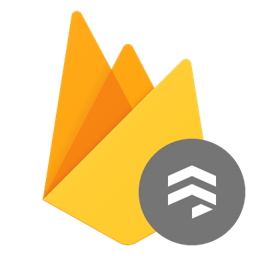 | `from resources.firebase.develop import firestore` |
|  | `from resources.oci.devops import resource_mgmt_white` |
|  | `from resources.oci.devops import api_service_white` |
|  | `from resources.oci.devops import api_gateway` |
|  | `from resources.oci.devops import api_service` |
|  | `from resources.oci.devops import api_gateway_white` |
|  | `from resources.oci.devops import resource_mgmt` |
|  | `from resources.oci.network import vcn_white` |
|  | `from resources.oci.network import load_balancer_white` |
|  | `from resources.oci.network import security_lists_white` |
|  | `from resources.oci.network import route_table_white` |
|  | `from resources.oci.network import internet_gateway_white` |
|  | `from resources.oci.network import service_gateway` |
|  | `from resources.oci.network import drg` |
|  | `from resources.oci.network import vcn` |
|  | `from resources.oci.network import firewall` |
|  | `from resources.oci.network import service_gateway_white` |
| 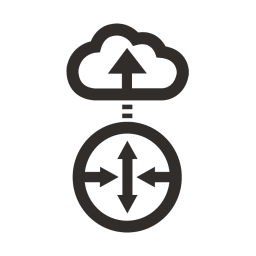 | `from resources.oci.network import internet_gateway` |
|  | `from resources.oci.network import drg_white` |
|  | `from resources.oci.network import firewall_white` |
|  | `from resources.oci.network import security_lists` |
|  | `from resources.oci.network import load_balancer` |
|  | `from resources.oci.network import route_table` |
|  | `from resources.oci.security import id_access` |
|  | `from resources.oci.security import encryption_white` |
|  | `from resources.oci.security import vault` |
|  | `from resources.oci.security import ddos_white` |
|  | `from resources.oci.security import waf` |
|  | `from resources.oci.security import key_management` |
|  | `from resources.oci.security import ddos` |
|  | `from resources.oci.security import max_security_zone_white` |
|  | `from resources.oci.security import vault_white` |
|  | `from resources.oci.security import waf_white` |
|  | `from resources.oci.security import encryption` |
|  | `from resources.oci.security import cloud_guard_white` |
|  | `from resources.oci.security import id_access_white` |
|  | `from resources.oci.security import cloud_guard` |
|  | `from resources.oci.security import max_security_zone` |
|  | `from resources.oci.security import key_management_white` |
|  | `from resources.oci.connectivity import customer_premise` |
|  | `from resources.oci.connectivity import dns` |
|  | `from resources.oci.connectivity import vpn_white` |
|  | `from resources.oci.connectivity import cdn` |
|  | `from resources.oci.connectivity import disconnected_regions_white` |
|  | `from resources.oci.connectivity import backbone_white` |
|  | `from resources.oci.connectivity import cdn_white` |
| 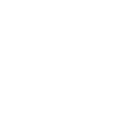 | `from resources.oci.connectivity import fast_connect_white` |
|  | `from resources.oci.connectivity import backbone` |
|  | `from resources.oci.connectivity import vpn` |
|  | `from resources.oci.connectivity import customer_premise_white` |
|  | `from resources.oci.connectivity import customer_datacntr_white` |
|  | `from resources.oci.connectivity import dns_white` |
|  | `from resources.oci.connectivity import fast_connect` |
|  | `from resources.oci.connectivity import customer_datacenter` |
| 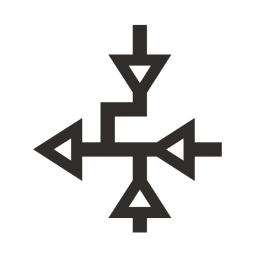 | `from resources.oci.connectivity import nat_gateway` |
|  | `from resources.oci.connectivity import nat_gateway_white` |
|  | `from resources.oci.connectivity import disconnected_regions` |
|  | `from resources.oci.database import dms` |
|  | `from resources.oci.database import database_service_white` |
|  | `from resources.oci.database import dms_white` |
|  | `from resources.oci.database import autonomous_white` |
|  | `from resources.oci.database import bigdata_service_white` |
|  | `from resources.oci.database import science_white` |
|  | `from resources.oci.database import database_service` |
|  | `from resources.oci.database import science` |
|  | `from resources.oci.database import dcat_white` |
|  | `from resources.oci.database import stream_white` |
|  | `from resources.oci.database import dis_white` |
|  | `from resources.oci.database import bigdata_service` |
|  | `from resources.oci.database import autonomous` |
|  | `from resources.oci.database import dataflow_apache` |
|  | `from resources.oci.database import dataflow_apache_white` |
|  | `from resources.oci.database import stream` |
|  | `from resources.oci.database import dcat` |
| 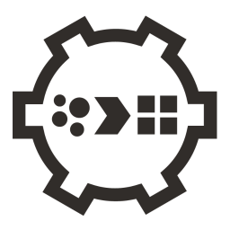 | `from resources.oci.database import dis` |
|  | `from resources.oci.monitoring import alarm` |
|  | `from resources.oci.monitoring import queue_white` |
|  | `from resources.oci.monitoring import notifications_white` |
|  | `from resources.oci.monitoring import queue` |
|  | `from resources.oci.monitoring import search` |
|  | `from resources.oci.monitoring import notifications` |
|  | `from resources.oci.monitoring import alarm_white` |
| 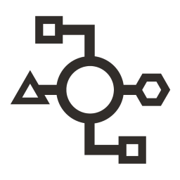 | `from resources.oci.monitoring import events` |
|  | `from resources.oci.monitoring import telemetry` |
|  | `from resources.oci.monitoring import events_white` |
|  | `from resources.oci.monitoring import workflow` |
|  | `from resources.oci.monitoring import email_white` |
|  | `from resources.oci.monitoring import workflow_white` |
|  | `from resources.oci.monitoring import search_white` |
|  | `from resources.oci.monitoring import health_check` |
|  | `from resources.oci.monitoring import telemetry_white` |
|  | `from resources.oci.monitoring import email` |
|  | `from resources.oci.monitoring import health_check_white` |
|  | `from resources.oci.compute import autoscale` |
|  | `from resources.oci.compute import bm` |
|  | `from resources.oci.compute import functions` |
|  | `from resources.oci.compute import ocir` |
|  | `from resources.oci.compute import container_white` |
|  | `from resources.oci.compute import oke` |
|  | `from resources.oci.compute import oke_white` |
|  | `from resources.oci.compute import instance_pools_white` |
|  | `from resources.oci.compute import autoscale_white` |
|  | `from resources.oci.compute import vm` |
|  | `from resources.oci.compute import container` |
|  | `from resources.oci.compute import bm_white` |
|  | `from resources.oci.compute import instance_pools` |
|  | `from resources.oci.compute import ocir_white` |
|  | `from resources.oci.compute import functions_white` |
|  | `from resources.oci.compute import vm_white` |
|  | `from resources.oci.governance import logging` |
|  | `from resources.oci.governance import compartments_white` |
|  | `from resources.oci.governance import groups_white` |
|  | `from resources.oci.governance import ocid_white` |
|  | `from resources.oci.governance import compartments` |
|  | `from resources.oci.governance import tagging_white` |
|  | `from resources.oci.governance import tagging` |
|  | `from resources.oci.governance import groups` |
|  | `from resources.oci.governance import logging_white` |
|  | `from resources.oci.governance import policies` |
|  | `from resources.oci.governance import audit` |
|  | `from resources.oci.governance import ocid` |
|  | `from resources.oci.governance import audit_white` |
|  | `from resources.oci.governance import policies_white` |
|  | `from resources.oci.storage import object_storage_white` |
|  | `from resources.oci.storage import backup_restore_white` |
|  | `from resources.oci.storage import buckets_white` |
|  | `from resources.oci.storage import data_transfer` |
|  | `from resources.oci.storage import block_storage_clone` |
|  | `from resources.oci.storage import storage_gateway` |
| 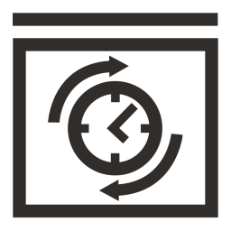 | `from resources.oci.storage import backup_restore` |
|  | `from resources.oci.storage import file_storage_white` |
|  | `from resources.oci.storage import file_storage` |
|  | `from resources.oci.storage import block_storage_white` |
|  | `from resources.oci.storage import block_storage_clone_white` |
|  | `from resources.oci.storage import storage_gateway_white` |
|  | `from resources.oci.storage import elastic_performance` |
|  | `from resources.oci.storage import elastic_performance_white` |
|  | `from resources.oci.storage import data_transfer_white` |
|  | `from resources.oci.storage import object_storage` |
|  | `from resources.oci.storage import buckets` |
|  | `from resources.oci.storage import block_storage` |
|  | `from resources.outscale.network import net` |
|  | `from resources.outscale.network import nat_service` |
|  | `from resources.outscale.network import load_balancer` |
|  | `from resources.outscale.network import site_to_site_vpng` |
|  | `from resources.outscale.network import client_vpn` |
|  | `from resources.outscale.network import internet_service` |
|  | `from resources.outscale.security import identity_and_access_management` |
| 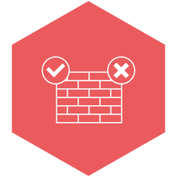 | `from resources.outscale.security import firewall` |
|  | `from resources.outscale.compute import direct_connect` |
|  | `from resources.outscale.compute import compute` |
|  | `from resources.outscale.storage import simple_storage_service` |
|  | `from resources.outscale.storage import storage` |
|  | `from resources.elastic.elasticsearch import kibana` |
|  | `from resources.elastic.elasticsearch import security_settings` |
|  | `from resources.elastic.elasticsearch import monitoring` |
|  | `from resources.elastic.elasticsearch import machine_learning` |
|  | `from resources.elastic.elasticsearch import logstash` |
|  | `from resources.elastic.elasticsearch import alerting` |
|  | `from resources.elastic.elasticsearch import sql` |
|  | `from resources.elastic.elasticsearch import beats` |
|  | `from resources.elastic.elasticsearch import maps` |
|  | `from resources.elastic.elasticsearch import elasticsearch` |
|  | `from resources.elastic.saas import elastic` |
|  | `from resources.elastic.saas import cloud` |
|  | `from resources.elastic.observability import apm` |
|  | `from resources.elastic.observability import uptime` |
|  | `from resources.elastic.observability import metrics` |
|  | `from resources.elastic.observability import logs` |
|  | `from resources.elastic.observability import observability` |
|  | `from resources.elastic.security import endpoint` |
|  | `from resources.elastic.security import security` |
|  | `from resources.elastic.security import siem` |
|  | `from resources.elastic.enterprisesearch import workplace_search` |
|  | `from resources.elastic.enterprisesearch import site_search` |
|  | `from resources.elastic.enterprisesearch import app_search` |
|  | `from resources.elastic.enterprisesearch import enterprise_search` |
|  | `from resources.elastic.orchestration import ece` |
|  | `from resources.elastic.orchestration import eck` |
|  | `from resources.ibm.devops import continuous_testing` |
|  | `from resources.ibm.devops import build_test` |
|  | `from resources.ibm.devops import provision` |
|  | `from resources.ibm.devops import release_management` |
|  | `from resources.ibm.devops import configuration_management` |
|  | `from resources.ibm.devops import collaborative_development` |
|  | `from resources.ibm.devops import artifact_management` |
|  | `from resources.ibm.devops import continuous_deploy` |
|  | `from resources.ibm.devops import devops` |
|  | `from resources.ibm.devops import code_editor` |
|  | `from resources.ibm.data import data_services` |
|  | `from resources.ibm.data import file_repository` |
|  | `from resources.ibm.data import device_identity_service` |
|  | `from resources.ibm.data import caches` |
|  | `from resources.ibm.data import device_registry` |
|  | `from resources.ibm.data import ground_truth` |
|  | `from resources.ibm.data import enterprise_data` |
|  | `from resources.ibm.data import enterprise_user_directory` |
|  | `from resources.ibm.data import model` |
|  | `from resources.ibm.data import cloud` |
|  | `from resources.ibm.data import tms_data_interface` |
|  | `from resources.ibm.data import conversation_trained_deployed` |
|  | `from resources.ibm.data import data_sources` |
|  | `from resources.ibm.network import load_balancing_routing` |
|  | `from resources.ibm.network import subnet` |
|  | `from resources.ibm.network import gateway` |
|  | `from resources.ibm.network import enterprise` |
|  | `from resources.ibm.network import router` |
|  | `from resources.ibm.network import vpn_policy` |
|  | `from resources.ibm.network import public_gateway` |
|  | `from resources.ibm.network import bridge` |
|  | `from resources.ibm.network import rules` |
|  | `from resources.ibm.network import vpn_gateway` |
|  | `from resources.ibm.network import firewall` |
|  | `from resources.ibm.network import floating_ip` |
|  | `from resources.ibm.network import vpc` |
|  | `from resources.ibm.network import transit_gateway` |
|  | `from resources.ibm.network import direct_link` |
|  | `from resources.ibm.network import load_balancer_pool` |
|  | `from resources.ibm.network import vpn_connection` |
|  | `from resources.ibm.network import load_balancer` |
|  | `from resources.ibm.network import region` |
|  | `from resources.ibm.network import load_balancer_listener` |
|  | `from resources.ibm.network import internet_services` |
|  | `from resources.ibm.security import security_services` |
|  | `from resources.ibm.security import gateway` |
|  | `from resources.ibm.security import trustend_computing` |
|  | `from resources.ibm.security import infrastructure_security` |
|  | `from resources.ibm.security import governance_risk_compliance` |
|  | `from resources.ibm.security import firewall` |
|  | `from resources.ibm.security import vpn` |
|  | `from resources.ibm.security import blockchain_security_service` |
|  | `from resources.ibm.security import identity_provider` |
|  | `from resources.ibm.security import identity_access_management` |
|  | `from resources.ibm.security import security_monitoring_intelligence` |
|  | `from resources.ibm.security import api_security` |
|  | `from resources.ibm.security import data_security` |
|  | `from resources.ibm.security import physical_security` |
|  | `from resources.ibm.blockchain import blockchain_developer` |
|  | `from resources.ibm.blockchain import communication` |
|  | `from resources.ibm.blockchain import key_management` |
|  | `from resources.ibm.blockchain import client_application` |
|  | `from resources.ibm.blockchain import node` |
|  | `from resources.ibm.blockchain import services` |
|  | `from resources.ibm.blockchain import transaction_manager` |
|  | `from resources.ibm.blockchain import wallet` |
|  | `from resources.ibm.blockchain import event` |
|  | `from resources.ibm.blockchain import event_listener` |
|  | `from resources.ibm.blockchain import message_bus` |
|  | `from resources.ibm.blockchain import certificate_authority` |
|  | `from resources.ibm.blockchain import consensus` |
|  | `from resources.ibm.blockchain import ledger` |
|  | `from resources.ibm.blockchain import membership` |
|  | `from resources.ibm.blockchain import smart_contract` |
|  | `from resources.ibm.blockchain import hyperledger_fabric` |
|  | `from resources.ibm.blockchain import membership_services_provider_api` |
|  | `from resources.ibm.blockchain import blockchain` |
|  | `from resources.ibm.blockchain import existing_enterprise_systems` |
|  | `from resources.ibm.user import user` |
|  | `from resources.ibm.user import browser` |
|  | `from resources.ibm.user import sensor` |
|  | `from resources.ibm.user import integrated_digital_experiences` |
|  | `from resources.ibm.user import device` |
|  | `from resources.ibm.user import physical_entity` |
|  | `from resources.ibm.management import cloud_management` |
|  | `from resources.ibm.management import api_management` |
|  | `from resources.ibm.management import data_services` |
|  | `from resources.ibm.management import monitoring_metrics` |
|  | `from resources.ibm.management import cluster_management` |
|  | `from resources.ibm.management import device_management` |
|  | `from resources.ibm.management import content_management` |
|  | `from resources.ibm.management import alert_notification` |
|  | `from resources.ibm.management import service_management_tools` |
|  | `from resources.ibm.management import push_notifications` |
|  | `from resources.ibm.management import it_service_management` |
|  | `from resources.ibm.management import management` |
|  | `from resources.ibm.management import process_management` |
|  | `from resources.ibm.management import provider_cloud_portal_service` |
|  | `from resources.ibm.management import information_governance` |
|  | `from resources.ibm.applications import mobile_app` |
|  | `from resources.ibm.applications import application_logic` |
|  | `from resources.ibm.applications import app_server` |
|  | `from resources.ibm.applications import visual_recognition` |
|  | `from resources.ibm.applications import index` |
|  | `from resources.ibm.applications import saas_applications` |
|  | `from resources.ibm.applications import actionable_insight` |
|  | `from resources.ibm.applications import annotate` |
|  | `from resources.ibm.applications import iot_application` |
|  | `from resources.ibm.applications import api_polyglot_runtimes` |
|  | `from resources.ibm.applications import runtime_services` |
|  | `from resources.ibm.applications import microservice` |
|  | `from resources.ibm.applications import api_developer_portal` |
|  | `from resources.ibm.applications import enterprise_applications` |
|  | `from resources.ibm.applications import ontology` |
|  | `from resources.ibm.applications import open_source_tools` |
|  | `from resources.ibm.applications import speech_to_text` |
|  | `from resources.ibm.applications import service_broker` |
|  | `from resources.ibm.applications import visualization` |
|  | `from resources.ibm.compute import bare_metal_server` |
|  | `from resources.ibm.compute import power_instance` |
|  | `from resources.ibm.compute import instance` |
|  | `from resources.ibm.compute import key` |
|  | `from resources.ibm.compute import image_service` |
|  | `from resources.ibm.analytics import analytics` |
|  | `from resources.ibm.analytics import data_integration` |
|  | `from resources.ibm.analytics import device_analytics` |
|  | `from resources.ibm.analytics import data_repositories` |
|  | `from resources.ibm.analytics import streaming_computing` |
| 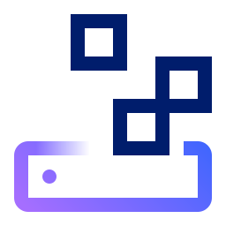 | `from resources.ibm.storage import object_storage` |
|  | `from resources.ibm.storage import block_storage` |
|  | `from resources.ibm.general import internet` |
|  | `from resources.ibm.general import scalable` |
|  | `from resources.ibm.general import offline_capabilities` |
|  | `from resources.ibm.general import cloudant` |
|  | `from resources.ibm.general import peer_cloud` |
|  | `from resources.ibm.general import microservices_mesh` |
|  | `from resources.ibm.general import enterprise` |
|  | `from resources.ibm.general import iot_cloud` |
|  | `from resources.ibm.general import infrastructure_security` |
|  | `from resources.ibm.general import openwhisk` |
|  | `from resources.ibm.general import monitoring_logging` |
|  | `from resources.ibm.general import governance_risk_compliance` |
|  | `from resources.ibm.general import monitoring` |
|  | `from resources.ibm.general import ibm_public_cloud` |
|  | `from resources.ibm.general import ibm_containers` |
|  | `from resources.ibm.general import cloud_services` |
|  | `from resources.ibm.general import identity_provider` |
|  | `from resources.ibm.general import cognitive_services` |
|  | `from resources.ibm.general import object_storage` |
|  | `from resources.ibm.general import cloud_messaging` |
|  | `from resources.ibm.general import transformation_connectivity` |
|  | `from resources.ibm.general import identity_access_management` |
|  | `from resources.ibm.general import text_to_speech` |
|  | `from resources.ibm.general import retrieve_rank` |
|  | `from resources.ibm.general import data_security` |
|  | `from resources.ibm.general import microservices_application` |
|  | `from resources.ibm.general import service_discovery_configuration` |
|  | `from resources.ibm.social import file_sync` |
|  | `from resources.ibm.social import networking` |
|  | `from resources.ibm.social import communities` |
|  | `from resources.ibm.social import live_collaboration` |
|  | `from resources.ibm.social import messaging` |
|  | `from resources.ibm.infrastructure import load_balancing_routing` |
|  | `from resources.ibm.infrastructure import mobile_backend` |
|  | `from resources.ibm.infrastructure import microservices_mesh` |
|  | `from resources.ibm.infrastructure import diagnostics` |
|  | `from resources.ibm.infrastructure import dashboard` |
|  | `from resources.ibm.infrastructure import monitoring_logging` |
|  | `from resources.ibm.infrastructure import channels` |
|  | `from resources.ibm.infrastructure import monitoring` |
|  | `from resources.ibm.infrastructure import peer_services` |
|  | `from resources.ibm.infrastructure import edge_services` |
|  | `from resources.ibm.infrastructure import event_feed` |
|  | `from resources.ibm.infrastructure import mobile_provider_network` |
|  | `from resources.ibm.infrastructure import infrastructure_services` |
|  | `from resources.ibm.infrastructure import cloud_messaging` |
|  | `from resources.ibm.infrastructure import transformation_connectivity` |
|  | `from resources.ibm.infrastructure import enterprise_messaging` |
|  | `from resources.ibm.infrastructure import interservice_communication` |
|  | `from resources.ibm.infrastructure import service_discovery_configuration` |
|  | `from resources.gcp.iot import iot_core` |
|  | `from resources.gcp.migration import transfer_appliance` |
|  | `from resources.gcp.api import endpoints` |
|  | `from resources.gcp.api import api_gateway` |
|  | `from resources.gcp.operations import monitoring` |
|  | `from resources.gcp.network import virtual_private_cloud` |
|  | `from resources.gcp.network import armor` |
|  | `from resources.gcp.network import nat` |
|  | `from resources.gcp.network import firewall_rules` |
|  | `from resources.gcp.network import routes` |
|  | `from resources.gcp.network import dns` |
|  | `from resources.gcp.network import router` |
|  | `from resources.gcp.network import load_balancing` |
|  | `from resources.gcp.network import partner_interconnect` |
|  | `from resources.gcp.network import cdn` |
|  | `from resources.gcp.network import standard_network_tier` |
|  | `from resources.gcp.network import external_ip_addresses` |
| 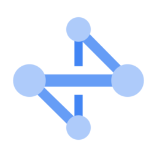 | `from resources.gcp.network import network` |
|  | `from resources.gcp.network import vpn` |
|  | `from resources.gcp.network import traffic_director` |
|  | `from resources.gcp.network import premium_network_tier` |
|  | `from resources.gcp.network import dedicated_interconnect` |
|  | `from resources.gcp.security import iam` |
|  | `from resources.gcp.security import security_command_center` |
|  | `from resources.gcp.security import resource_manager` |
|  | `from resources.gcp.security import security_scanner` |
|  | `from resources.gcp.security import iap` |
|  | `from resources.gcp.security import key_management_service` |
|  | `from resources.gcp.database import spanner` |
|  | `from resources.gcp.database import sql` |
|  | `from resources.gcp.database import bigtable` |
|  | `from resources.gcp.database import datastore` |
|  | `from resources.gcp.database import memorystore` |
|  | `from resources.gcp.database import firestore` |
|  | `from resources.gcp.compute import functions` |
|  | `from resources.gcp.compute import kubernetes_engine` |
|  | `from resources.gcp.compute import container_optimized_os` |
|  | `from resources.gcp.compute import app_engine` |
|  | `from resources.gcp.compute import compute_engine` |
|  | `from resources.gcp.compute import gpu` |
|  | `from resources.gcp.compute import gke_on_prem` |
|  | `from resources.gcp.compute import run` |
|  | `from resources.gcp.devtools import source_repositories` |
| 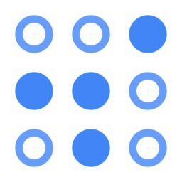 | `from resources.gcp.devtools import test_lab` |
|  | `from resources.gcp.devtools import tasks` |
|  | `from resources.gcp.devtools import tools_for_eclipse` |
|  | `from resources.gcp.devtools import build` |
|  | `from resources.gcp.devtools import tools_for_powershell` |
|  | `from resources.gcp.devtools import code_for_intellij` |
|  | `from resources.gcp.devtools import container_registry` |
|  | `from resources.gcp.devtools import gradle_app_engine_plugin` |
|  | `from resources.gcp.devtools import sdk` |
|  | `from resources.gcp.devtools import maven_app_engine_plugin` |
|  | `from resources.gcp.devtools import tools_for_visual_studio` |
|  | `from resources.gcp.devtools import ide_plugins` |
|  | `from resources.gcp.devtools import code` |
|  | `from resources.gcp.devtools import scheduler` |
|  | `from resources.gcp.analytics import genomics` |
|  | `from resources.gcp.analytics import dataproc` |
|  | `from resources.gcp.analytics import data_fusion` |
|  | `from resources.gcp.analytics import dataprep` |
|  | `from resources.gcp.analytics import bigquery` |
|  | `from resources.gcp.analytics import pubsub` |
|  | `from resources.gcp.analytics import data_catalog` |
|  | `from resources.gcp.analytics import dataflow` |
|  | `from resources.gcp.analytics import composer` |
|  | `from resources.gcp.analytics import datalab` |
|  | `from resources.gcp.storage import filestore` |
|  | `from resources.gcp.storage import persistent_disk` |
|  | `from resources.gcp.storage import storage` |
|  | `from resources.gcp.ml import tpu` |
|  | `from resources.gcp.ml import jobs_api` |
|  | `from resources.gcp.ml import ai_platform_data_labeling_service` |
|  | `from resources.gcp.ml import translation_api` |
|  | `from resources.gcp.ml import ai_platform` |
| 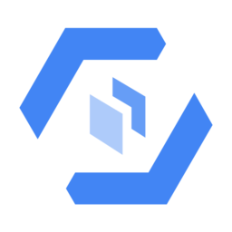 | `from resources.gcp.ml import automl_tables` |
|  | `from resources.gcp.ml import advanced_solutions_lab` |
|  | `from resources.gcp.ml import natural_language_api` |
|  | `from resources.gcp.ml import automl_natural_language` |
|  | `from resources.gcp.ml import automl_vision` |
|  | `from resources.gcp.ml import automl_translation` |
|  | `from resources.gcp.ml import video_intelligence_api` |
|  | `from resources.gcp.ml import automl_video_intelligence` |
|  | `from resources.gcp.ml import recommendations_ai` |
|  | `from resources.gcp.ml import dialog_flow_enterprise_edition` |
|  | `from resources.gcp.ml import automl` |
| 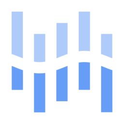 | `from resources.gcp.ml import inference_api` |
|  | `from resources.gcp.ml import text_to_speech` |
|  | `from resources.gcp.ml import speech_to_text` |
| 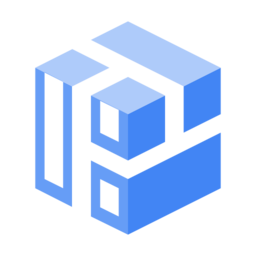 | `from resources.gcp.ml import ai_hub` |
|  | `from resources.gcp.ml import vision_api` |
