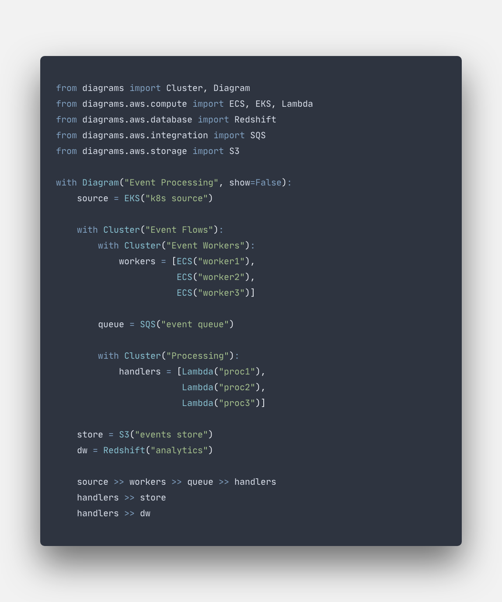

# Diagrams

## Diagrams as Code

- [Try it out](getting-started/installation.md)
- [Show examples](getting-started/examples.md)

## About Diagrams

Diagrams lets you draw the cloud system architecture **in Python code**.

It was born for **prototyping** a new system architecture without any design tools. You can also describe or visualize the existing system architecture as well.

Diagram as Code allows you to **track** the architecture diagram changes in any **version control** system.

Diagrams currently supports six major providers: AWS, Azure, GCP, Kubernetes, Alibaba Cloud and Oracle Cloud. It now also supports On-Premise nodes as well as Programming Languages and Frameworks.

